---
## Front matter
title: "Лабораторная работа No 6.  "
subtitle: "Поиск файлов. Перенаправление
ввода-вывода. Просмотр запущенных процессов"
author: "Сарасбати Брасалес"

## Generic otions
lang: ru-RU
toc-title: "Содержание"

## Bibliography
bibliography: bib/cite.bib
csl: pandoc/csl/gost-r-7-0-5-2008-numeric.csl

## Pdf output format
toc: true # Table of contents
toc-depth: 2
lof: true # List of figures
lot: true # List of tables
fontsize: 12pt
linestretch: 1.5
papersize: a4
documentclass: scrreprt
## I18n polyglossia
polyglossia-lang:
  name: russian
  options:
	- spelling=modern
	- babelshorthands=true
polyglossia-otherlangs:
  name: english
## I18n babel
babel-lang: russian
babel-otherlangs: english
## Fonts
mainfont: PT Serif
romanfont: PT Serif
sansfont: PT Sans
monofont: PT Mono
mainfontoptions: Ligatures=TeX
romanfontoptions: Ligatures=TeX
sansfontoptions: Ligatures=TeX,Scale=MatchLowercase
monofontoptions: Scale=MatchLowercase,Scale=0.9
## Biblatex
biblatex: true
biblio-style: "gost-numeric"
biblatexoptions:
  - parentracker=true
  - backend=biber
  - hyperref=auto
  - language=auto
  - autolang=other*
  - citestyle=gost-numeric
## Pandoc-crossref LaTeX customization
figureTitle: "Рис."
tableTitle: "Таблица"
listingTitle: "Листинг"
lofTitle: "Список иллюстраций"
lotTitle: "Список таблиц"
lolTitle: "Листинги"
## Misc options
indent: true
header-includes:
  - \usepackage{indentfirst}
  - \usepackage{float} # keep figures where there are in the text
  - \floatplacement{figure}{H} # keep figures where there are in the text
---

# Цель работы

Ознакомление с инструментами поиска файлов и фильтрации текстовых данных.
Приобретение практических навыков: по управлению процессами (и заданиями), по
проверке использования диска и обслуживанию файловых систем.

# Задание

1. Осуществите вход в систему, используя соответствующее имя пользователя.
2. Запишите в файл file.txt названия файлов, содержащихся в каталоге /etc. Допи-
шите в этот же файл названия файлов, содержащихся в вашем домашнем каталоге.
3. Выведите имена всех файлов из file.txt, имеющих расширение .conf, после чего
запишите их в новый текстовой файл conf.txt.
4. Определите, какие файлы в вашем домашнем каталоге имеют имена, начинавшиеся
с символа c? Предложите несколько вариантов, как это сделать.
5. Выведите на экран (по странично) имена файлов из каталога /etc, начинающиеся
с символа h.
6. Запустите в фоновом режиме процесс, который будет записывать в файл ~/logfile
файлы, имена которых начинаются с log.
7. Удалите файл ~/logfile.
8. Запустите из консоли в фоновом режиме редактор gedit.
9. Определите идентификатор процесса gedit, используя команду ps, конвейер и фильтр
grep. Как ещё можно определить идентификатор процесса?
10. Прочтите справку (man) команды kill, после чего используйте её для завершения
процесса gedit.
11. Выполните команды df и du, предварительно получив более подробную информацию
об этих командах, с помощью команды man.
12. Воспользовавшись справкой команды find, выведите имена всех директорий, имею-
щихся в вашем домашнем каталоге

# Теоретическое введение

Перенаправление ввода-вывода
В системе по умолчанию открыто три специальных потока:
– stdin — стандартный поток ввода (по умолчанию: клавиатура), файловый дескриптор
0;
– stdout — стандартный поток вывода (по умолчанию: консоль), файловый дескриптор
1;
– stderr — стандартный поток вывод сообщений об ошибках (по умолчанию: консоль),
файловый дескриптор 2.
Большинство используемых в консоли команд и программ записывают результаты
своей работы в стандартный поток вывода stdout. Например, команда ls выводит в стан-
дартный поток вывода (консоль) список файлов в текущей директории. Потоки вывода
и ввода можно перенаправлять на другие файлы или устройства. Проще всего это делается
с помощью символов >, >>, <, <<. 
6.2.2. Конвейер
Конвейер (pipe) служит для объединения простых команд или утилит в цепочки, в ко-
торых результат работы предыдущей команды передаётся последующей. Синтаксис
следующий:
1 команда 1 | команда 2
2 # означает, что вывод команды 1 передастся на ввод команде 2
Конвейеры можно группировать в цепочки и выводить с помощью перенаправления
в файл, например:
1 ls -la |sort > sortilg_list
вывод команды ls -la передаётся команде сортировки sort\verb, которая пишет ре-
зультат в файл sorting_list\verb.
Чаще всего скрипты на Bash используются в качестве автоматизации каких-то рутин-
ных операций в консоли, отсюда иногда возникает необходимость в обработке stdout
одной команды и передача на stdin другой команде, при этом результат выполнения
команды должен обработан.
6.2.3. Поиск файла
Команда find используется для поиска и отображения на экран имён файлов, соответ-
ствующих заданной строке символов.
Формат команды:
ind путь [-опции]
Путь определяет каталог, начиная с которого по всем подкаталогам будет вестись
поиск.
Кулябов Д. С. и др. Операционные системы 57
6.2.4. Фильтрация текста
Найти в текстовом файле указанную строку символов позволяет команда grep.
Формат команды:
1 grep строка имя_файла
Кроме того, команда grep способна обрабатывать стандартный вывод других команд
(любой текст). Для этого следует использовать конвейер, связав вывод команды с вводом
grep.

# Выполнение лабораторной работы

 Я вхожу как root(рис. @fig:001).

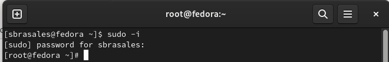{#fig:001 width=70%}

затем я перешла в домашний каталог (home/sbrasales) и создала файл file.txt. Я использую команду "ls >>file.txt". Команда "cat" подтвердила, что все прошло хорошо.

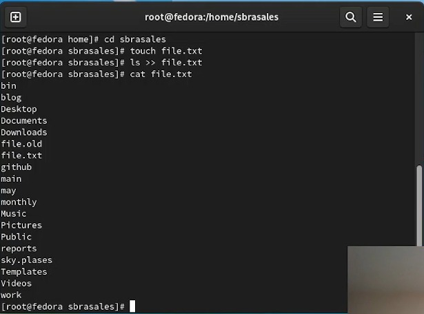{#fig:002 width=70%}

Потом я перешла в катлог /etc и командой ls /etc >> /home/sbrasales/file.txt я переписала названия файлов оттуда в файл file.txt.

{#fig:003 width=70%}

затем я проверяю содержимое файла file.txt с помощью команды "cat"

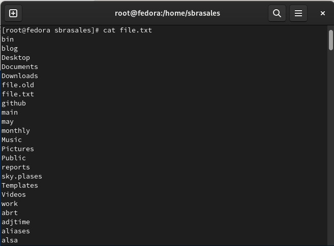{#fig:004 width=70%}

Я создала файл "conf.txt" и с помощью команды grep '/.comf' file.txt нашла все файлы "file.txt" с расширением "conf"

{#fig:005 width=70%}

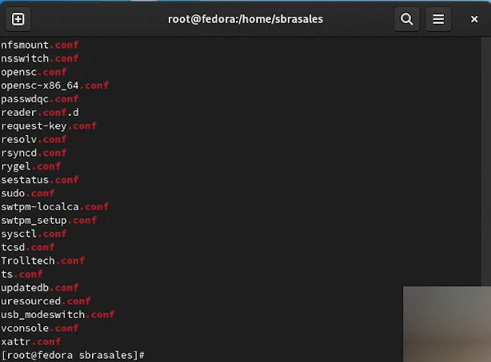{#fig:006 width=70%}

После этого прописала все найденные файлы conf.txt командой grep '/.conf' file.txt comf.txt. 

{#fig:007 width=70%}

Я проверяю команду "cat'

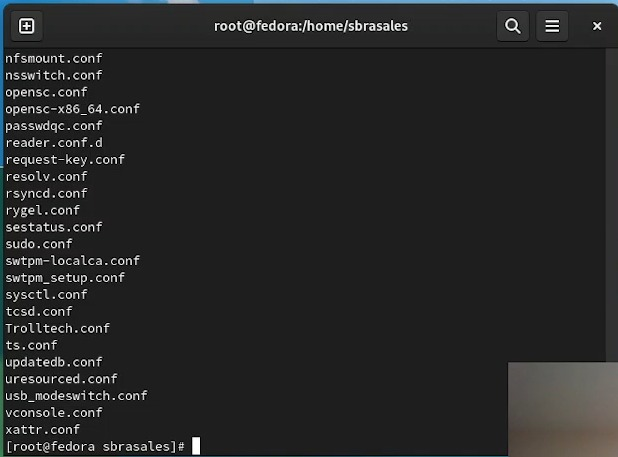{#fig:008 width=70%}

Далее, по заднию, командой find -name "c" -print* я нашла все файлы домашнего каталога, которые начинаются на 'c'.

{#fig:009 width=70%}

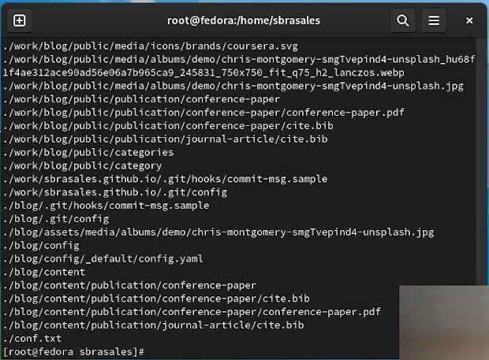{#fig:010 width=70%}

Требовалось найти такие фалы разными способами, поэтому я нашла их еще одной командой ls -R | grep ^c.

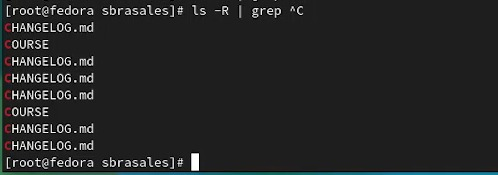{#fig:011 width=70%}

Следующим шагом я, перейдя в катлог /etc, постранично вывела его файлы, имена которых начинались на h командой grep h*.

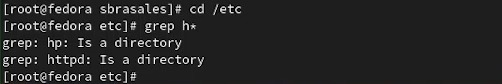{#fig:012 width=70%}

Далее я вернулась в домашний каталог и создала там файл logfile. Командой find -name "log" -print >> logfile & я в фоновом режиме запустила процесс, который записывает в logfile все файлы, начинающиеся с 'log'. Команда cat проверила выполнение.

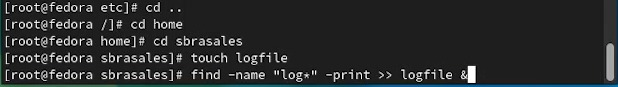{#fig:013 width=70%}

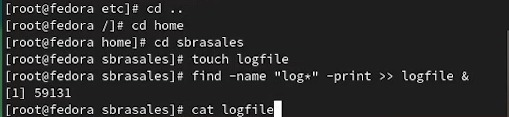{#fig:014 width=70%}

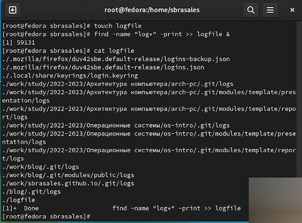{#fig:015 width=70%}

После я удалила logfile командой rm.

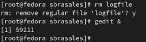{#fig:016 width=70%}

ps aux | grep gedit

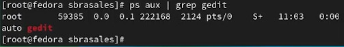{#fig:017 width=70%}

ps aux

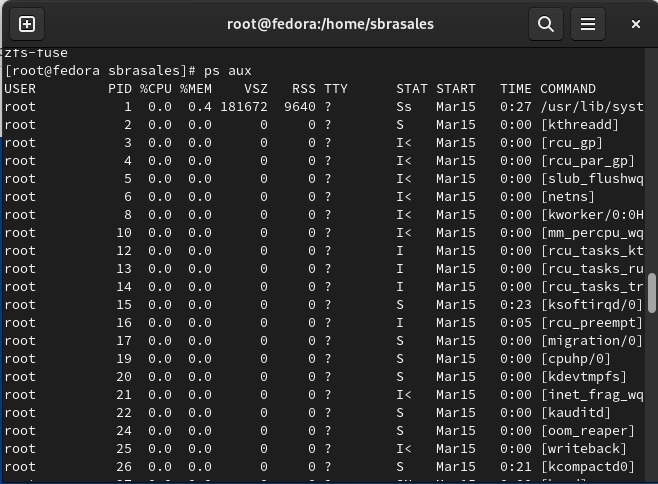{#fig:018 width=70%}

Узнала подробнее о команде df, используя man и выполнила команду df -vi из примера

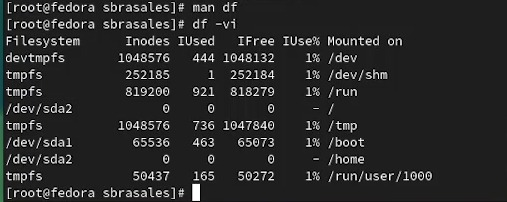{#fig:019 width=70%}

Таким же способом узнала о команде du и выполнила du -a ~/.

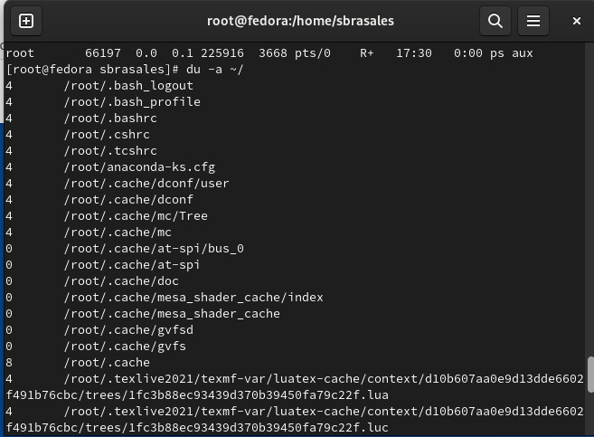{#fig:020 width=70%}

Последним заданием было вывести имена всех директорий, имеющихся в домашнем каталоге, с помощью find. Используя man, я нашла нужную опцию и ввела команду find -maxdepth 1.

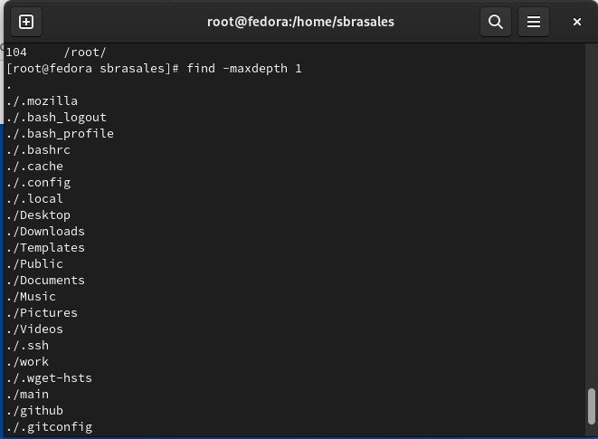{#fig:021 width=70%}

# Выводы

Таким образом, мы ознакомились с инструментами поиска файлов и фильтрации тектсовых данных и приобрели прктические навыки по:

управлению процессамим(и заданиями)

проверке использования диска и обслуживанию файловых систем.

# Контрольные вопросы

Какие потоки ввода вывода вы знаете?
В системе по умолчанию открыто три специальных потока:

– stdin — стандартный поток ввода (по умолчанию: клавиатура), файловый дескриптор 0;

– stdout — стандартный поток вывода (по умолчанию: консоль), файловый дескриптор 1;

– stderr — стандартный поток вывод сообщений об ошибках (по умолчанию: консоль), файловый дескриптор 2.

Объясните разницу между операцией > и >>.
Операция > перезаписывает существующие файлы или создает новые, если файла с указанным именем не существует.
Операция >> добавляет существующий файл или создает новый, если файл с указанным именем отсутствует.
Что такое конвейер?
Конвейр - способ объединения простых команд или утилит в цепочки, в которых результат работы предыдущей команды передаётся последующей.

Что такое процесс? Чем это понятие отличается от программы?
Процесс - это программа, выполняющаяся в отдельном виртуальном адресном пространстве. По сути, каждый процесс - это экзепляр программы, выполняемой компьютером, а программа - набор инструкци для выполнения какой-то задачи. Процесс, в отличие от программы, живет меньше и требует определенные ресурсы компьютера (память, устройтсво ввода-вывода, процессор)

Что такое PID и GID?
PID (Process ID) - идентификтаор процесса.

GID (Group ID) -идентификатор группы.

Что такое задачи и какая команда позволяет ими управлять?
Задачи - запущенные в фоновом ржиме программы. Ими можно управлять с помощью команды jobs.

Найдите информацию об утилитах top и htop. Каковы их функции?
top - консольная команда, которая выводит список работающих в системе процессов и информацию о них. По умолчанию она в реальном времени сортирует их по нагрузке на процессор.

htop - аналог top. Она показывает динамический список системных процессов, список обычно выравнивается по использованию ЦПУ. В отличие от top, htop показывает все процессы в системе. Также показывает время непрерывной работы, использование процессоров и памяти.

Назовите и дайте характеристику команде поиска файлов. Приведите примеры использования этой команды.
Поиск файлов осущесвляется с помощью команды find. Она может вывести файлы, соответсвующи е заданной строке символов. Синтаксис: find путь [ -опции ]. Путь определяет каталог, начиная с которого по всем подкаталогам будет вестись поиск.

Примеры:

find -name "for*" -print

Данная команда в текущем каталоге найдет файлы, начинающиеся с for и выведет их на экран. Также примеры можно увидеть в выполнении лабораторной работы.

Можно ли по контексту (содержанию) найти файл? Если да, то как?
Можно, это делается с помощью команды grep. Данная команда позволяет найти в текстовом файле указанную строку символов.

# Список литературы{.unnumbered}

::: {#refs}
:::
