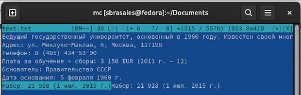

---
## Front matter
title: "Лабораторная работа No 7"
subtitle: "Командная оболочка Midnight Commander"
author: "Брасалес Сарасбати"

## Generic otions
lang: ru-RU
toc-title: "Содержание"

## Bibliography
bibliography: bib/cite.bib
csl: pandoc/csl/gost-r-7-0-5-2008-numeric.csl

## Pdf output format
toc: true # Table of contents
toc-depth: 2
lof: true # List of figures
lot: true # List of tables
fontsize: 12pt
linestretch: 1.5
papersize: a4
documentclass: scrreprt
## I18n polyglossia
polyglossia-lang:
  name: russian
  options:
	- spelling=modern
	- babelshorthands=true
polyglossia-otherlangs:
  name: english
## I18n babel
babel-lang: russian
babel-otherlangs: english
## Fonts
mainfont: PT Serif
romanfont: PT Serif
sansfont: PT Sans
monofont: PT Mono
mainfontoptions: Ligatures=TeX
romanfontoptions: Ligatures=TeX
sansfontoptions: Ligatures=TeX,Scale=MatchLowercase
monofontoptions: Scale=MatchLowercase,Scale=0.9
## Biblatex
biblatex: true
biblio-style: "gost-numeric"
biblatexoptions:
  - parentracker=true
  - backend=biber
  - hyperref=auto
  - language=auto
  - autolang=other*
  - citestyle=gost-numeric
## Pandoc-crossref LaTeX customization
figureTitle: "Рис."
tableTitle: "Таблица"
listingTitle: "Листинг"
lofTitle: "Список иллюстраций"
lotTitle: "Список таблиц"
lolTitle: "Листинги"
## Misc options
indent: true
header-includes:
  - \usepackage{indentfirst}
  - \usepackage{float} # keep figures where there are in the text
  - \floatplacement{figure}{H} # keep figures where there are in the text
---

# Цель работы

Освоение основных возможностей командной оболочки Midnight Commander. Приоб-
ретение навыков практической работы по просмотру каталогов и файлов; манипуляций
с ними.

# Задание

7.3.1. Задание по mc
1. Изучите информацию о mc, вызвав в командной строке man mc.
2. Запустите из командной строки mc, изучите его структуру и меню.
68 Лабораторная работа No 7. Командная оболочка Midnight Commander
Таблица 7.2
Клавиши для редактирования файла
Ctrl-y удалить строку
Ctrl-u отмена последней операции
Ins вставка/замена
F7 поиск (можно использовать регулярные выражения)
-F7 повтор последней операции поиска
F4 замена
F3 первое нажатие — начало выделения, второе — окончание
выделения
F5 копировать выделенный фрагмент
F6 переместить выделенный фрагмент
F8 удалить выделенный фрагмент
F2 записать изменения в файл
F10 выйти из редактора
3. Выполните несколько операций в mc, используя управляющие клавиши (операции
с панелями; выделение/отмена выделения файлов, копирование/перемещение фай-
лов, получение информации о размере и правах доступа на файлы и/или каталоги
и т.п.)
4. Выполните основные команды меню левой (или правой) панели. Оцените степень
подробности вывода информации о файлах.
5. Используя возможности подменю Файл , выполните:
– просмотр содержимого текстового файла;
– редактирование содержимого текстового файла (без сохранения результатов
редактирования);
– создание каталога;
– копирование в файлов в созданный каталог.
6. С помощью соответствующих средств подменю Команда осуществите:
– поиск в файловой системе файла с заданными условиями (например, файла
с расширением .c или .cpp, содержащего строку main);
– выбор и повторение одной из предыдущих команд;
– переход в домашний каталог;
– анализ файла меню и файла расширений.
7. Вызовите подменю Настройки . Освойте операции, определяющие структуру экрана mc
(Full screen, Double Width, Show Hidden Files и т.д.)ю
7.3.2. Задание по встроенному редактору mc
1. Создайте текстовой файл text.txt.
2. Откройте этот файл с помощью встроенного в mc редактора.
3. Вставьте в открытый файл небольшой фрагмент текста, скопированный из любого
другого файла или Интернета.
4. Проделайте с текстом следующие манипуляции, используя горячие клавиши:
4.1. Удалите строку текста.
4.2. Выделите фрагмент текста и скопируйте его на новую строку.
4.3. Выделите фрагмент текста и перенесите его на новую строку.
4.4. Сохраните файл.
4.5. Отмените последнее действие.
4.6. Перейдите в конец файла (нажав комбинацию клавиш) и напишите некоторый
текст.
4.7. Перейдите в начало файла (нажав комбинацию клавиш) и напишите некоторый
текст.
4.8. Сохраните и закройте файл.
5. Откройте файл с исходным текстом на некотором языке программирования (напри-
мер C или Java)
6. Используя меню редактора, включите подсветку синтаксиса, если она не включена,
или выключите, если она включе

# Теоретическое введение

Общие сведения
Командная оболочка — интерфейс взаимодействия пользователя с операционной систе-
мой и программным обеспечением посредством команд.
Midnight Commander (или mc) — псевдографическая командная оболочка для UNIX/Linux
систем. Для запуска mc необходимо в командной строке набрать mc и нажать Enter .
Рабочее пространство mc имеет две панели, отображающие по умолчанию списки
файлов двух каталогов 
Над панелями располагается меню, доступ к которому осуществляется с помощью
клавиши F9 . Под панелями внизу расположены управляющие экранные кнопки, ассоци-
ированные с функциональными клавишами F1 – F10 (табл. 7.1). Над ними располагается
командная строка, предназначенная для ввода команд.
Режимы отображения панелей и управление ими
Панель в mc отображает список файлов текущего каталога. Абсолютный путь к этому
каталогу отображается в заголовке панели. У активной панели заголовок и одна из её
строк подсвечиваются. Управление панелями осуществляется с помощью определённых
комбинаций клавиш или пунктов меню mc.
Панели можно поменять местами. Для этого и используется комбинация клавиш Ctrl-u
или команда меню mc Переставить панели . Также можно временно убрать отображение
панелей (отключить их) с помощью комбинации клавиш Ctrl-o или команды меню mc
Отключить панели . Это может быть полезно, например, если необходимо увидеть вывод
какой-то информации на экран после выполнения какой-либо команды shell.
С помощью последовательного применения комбинации клавиш Ctrl-x d есть
возможность сравнения каталогов, отображённых на двух панелях. Панели могут допол-
нительно быть переведены в один из двух режимов: Информация или Дерево . В режиме
Информация (рис. 7.2) на панель выводятся сведения о файле и текущей файловой системе,
расположенных на активной панели. В режиме Дерево (рис. 7.3) на одной из панелей
выводится структура дерева каталогов.
Управлять режимами отображения панелей можно через пункты меню mc Правая панель
и Левая панель 

# Выполнение лабораторной работы

первое упражнение было посмотреть спрабку с mc (рис. @fig:001).

{#fig:001 width=70%}

Потом я ввела в терминале команду "mc" и изучила ее структуру. Справа и слева открыты каталоги, которые можно выбрать. Внизу есть командная строка, с помощью которой можно проводить различные манипуляции с выбранными каталогами. В самом низы указаны горячие клавиши. Самая верхня строчка представляет собой меню. Обратиться к нему можно через F9. В этой строке есть пять подменю: Левая панель, Файл, Команда, настройки и Правая панель. С помощью Enter эти подменю можно посмотреть подробнее.

{#fig:002 width=70%}

Я выполняю несколько операций.
Для смены панелей я использовал клавиши ctrl+u

{#fig:003 width=70%}

Используя Ctrl+o, я отключаю обе панели.

{#fig:004 width=70%}

я скопировал файл с помощью F5

{#fig:005 width=70%}

и я создаю каталог с помощью F6

{#fig:006 width=70%}

Далее я начала работать с панелями. Об открытых в них каталогах можно вывести информацию с помощью Ctrl+x i или открыв нужное в Меню. Менеджер выводит информацию на одной из панелей, и она достаточно полная. Указаны имя каталога, права доступа, владелец. Также указано то, когда каталог изменен и модифицирован. Можно увидеть, в каком каталоге находится этот подкаталог и размер подкаталога. Также указан тип, устройство, на котором расположен, и свободное место на устройстве. 

{#fig:007 width=70%}

{#fig:008 width=70%}

Затем я захожу в файл и редактирую его, не сохраняя изменений.

{#fig:009 width=70%}

Позже я создала каталог, который я называю «catalog».

{#fig:010 width=70%}

Я скопировала изображение в каталог, созданный с помощью F5

{#fig:011 width=70%}

Потом начала работу с командной строкой. Необходимо было в выбранном каталоге найти какие-то файлы.

{#fig:012 width=70%}

После с помощью подменю Команда я посмотрела файл раширений, в котором указана информация о расширениях в mc.

{#fig:013 width=70%}

А потом там же открыла файл меню, выбрав пользовательский формат. В файле написан код, по которому работает Меню.

{#fig:014 width=70%}

Вызываем подменю Настройки и изучаем его. В нем можно скорректировать настройки работы с панелями; поменять внешний вид и настройку панелей; протестировать функциональные клавиши; установить или убрать окно, которое запрашивает подтверждение действий после какой-либо операции; задать формат обработки ифнормации локальным терминалом.

{#fig:015 width=70%}

Следующие  проводились с редактором mc.
Я создала новый файл с именем text.txt с помощью touch

{#fig:016 width=70%}

В файл я добавила текст из интернета

{#fig:017 width=70%}

Я делала следующие шаги:

Удалить строку текста.

{#fig:018 width=70%}

Выделить фрагмент текста и скопируйте его на новую строку.

{#fig:019 width=70%}

Выделить фрагмент текста и перенесите его на новую строку.

{#fig:020 width=70%}

Сохранить файл.

{#fig:021 width=70%}

Отменить последнее действие.

{#fig:022 width=70%}

Перейдите в конец файла (нажав комбинацию клавиш) и напишите некоторый
текст.
Перейдите в начало файла (нажав комбинацию клавиш) и напишите некоторый
текст.

{#fig:023 width=70%}

# Выводы

Освоили основные возможности оболочки Midnight Commander и получили практические навыки просмотра директорий и файлов; манипуляции с ними.

# Контрольные вопросы

Какие режимы работы есть в mc. Охарактеризуйте их.
Стандартный режим работы mc - двые включенные панели, левая и правая, в которых отображаются каталоги. Также командную оболочку можно включить и в других режимах.

Режим быстрого просмотра - режим, в котором панель переключается на отображение содержимого файла, подсвеченного в другой панели.

Режим информации -режим, в котором на панель выводится информация о подсвеченном в другой панели файле и о текущей файловой системе (указаны имя каталога, права доступа, владелец; также указано то, когда каталог изменен и модифицирован; можно увидеть, в каком каталоге находится этот подкаталог и размер подкаталога; акже указан тип, устройство, на котором расположен, и свободное место на устройстве)

Режим дерева - режим, в котором показывается иерархия кататлогов в виде соединенного списка.

Какие операции с файлами можно выполнить как с помощью команд shell, так и с помощью меню (комбинаций клавиш) mc? Приведите несколько примеров.
Shell и mc имеют очень много одинаковых команд, которые можно выполнить. Примеры: копирование файлов, поиск.

Опишите структура меню левой (или правой) панели mc, дайте характеристику командам.
В левой и правой панелях показываются каталоги, которые мы выбрали. Список фалов позволяет посмотреть файлы в домашнем каталоге; Быстрый просмотр позволяет выполнить быстрый просмотр содержимого панели; Информация позволяет посмотреть информацию о файле или каталоге; Можно выбрать Формат списка с помощью соответсвующего подпункта; Порядок сортировки позволяет задать критерии сортировки при выводе списка файлов и каталогов: без сортировки, по имени, расширенный, время правки, время доступа, время изменения атрибута, размер, узел.

Опишите структура меню Файл mc, дайте характеристику командам.
Подменю Файл состоит из подпунктов:

– Просмотр ( F3 ) — позволяет посмотреть содержимое текущего (или выделенного) файла без возможности редактирования.

– Просмотр вывода команды ( М + ! ) — функция запроса команды с параметрами (аргумент к текущему выбранному файлу).

– Правка ( F4 ) — открывает текущий (или выделенный) файл для его редактирования.

– Копирование ( F5 ) — осуществляет копирование одного или нескольких файлов или каталогов в указанное пользователем во всплывающем окне место.

– Права доступа ( Ctrl-x c ) — позволяет указать (изменить) права доступа к одному или нескольким файлам или каталогам

– Жёсткая ссылка ( Ctrl-x l ) — позволяет создать жёсткую ссылку к текущему (или выделенному) файлу1 . – Символическая ссылка ( Ctrl-x s ) — позволяет создать символическую ссылку к текущему (или выделенному) файлу2 . – Владелец/группа ( Ctrl-x o ) — позволяет задать (изменить) владельца и имя группы для одного или нескольких файлов или каталогов.

– Права (расширенные) — позволяет изменить права доступа и владения для одного или нескольких файлов или каталогов.

– Переименование ( F6 ) — позволяет переименовать (или переместить) один или несколько файлов или каталогов.

– Создание каталога ( F7 ) — позволяет создать каталог.

– Удалить ( F8 ) — позволяет удалить один или несколько файлов или каталогов.

– Выход ( F10 ) — завершает работу mc.

Опишите структура меню Команда mc, дайте характеристику командам.
В меню Команда содержатся более общие команды для работы с mc

Команды меню Команда :

– Дерево каталогов — отображает структуру каталогов системы.

– Поиск файла — выполняет поиск файлов по заданным параметрам.

– Переставить панели — меняет местами левую и правую панели.

– Сравнить каталоги ( Ctrl-x d ) — сравнивает содержимое двух каталогов.

– Размеры каталогов — отображает размер и время изменения каталога (по умолчанию в mc размер каталога корректно не отображается).

– История командной строки — выводит на экран список ранее выполненных в оболочке команд.

– Каталоги быстрого доступа ( Ctrl-\ ) — пр вызове выполняется быстрая смена текущего каталога на один из заданного списка.

– Восстановление файлов — позволяет восстановить файлы на файловых системах ext2 и ext3.

– Редактировать файл расширений — позволяет задать с помощью определённого синтаксиса действия при запуске файлов с определённым расширением (например, какое программного обеспечение запускать для открытия или редактирования файлов с расширением doc или docx).

– Редактировать файл меню — позволяет отредактировать контекстное меню пользователя, вызываемое по клавише F2 .

– Редактировать файл расцветки имён — позволяет подобрать оптимальную для пользователя расцветку имён файлов в зависимости от их типа.

Опишите структура меню Настройки mc, дайте характеристику командам.
Меню Настройки содержит ряд дополнительных опций по внешнему виду и функциональности mc.

Меню Настройки содержит:

– Конфигурация — позволяет скорректировать настройки работы с панелями.

– Внешний вид и Настройки панелей — определяет элементы (строка меню, командная строка, подсказки и прочее), отображаемые при вызове mc, а также геометрию расположения панелей и цветовыделение.

– Биты символов — задаёт формат обработки информации локальным терминалом.

– Подтверждение — позволяет установить или убрать вывод окна с запросом подтверждения действий при операциях удаления и перезаписи файлов, а также при выходе из программы.

– Распознание клавиш — диалоговое окно используется для тестирования функциональных клавиш, клавиш управления курсором и прочее.

– Виртуальные ФС –– настройки виртуальной файловой системы: тайм-аут, пароль и прочее.

Назовите и дайте характеристику встроенным командам mc.
F1 - Вызов контекстно-зависимой подсказки

F2 - Вызов пользовательского меню с возможностью создания и/или дополнения дополнительных функций

F3 - Просмотр содержимого файла, на который указывает подсветка в активной панели (без возможности редактирования)

F4 - Вызов встроенного в mc редактора для изменения содержания файла, на который указывает подсветка в активной панели

F5 - Копирование одного или нескольких файлов, отмеченных в первой (активной) панели, в каталог, отображаемый на второй панели

F6 - Перенос одного или нескольких файлов, отмеченных в первой (активной) панели, в каталог, отображаемый на второй панели

F7 - Создание подкаталога в каталоге, отображаемом в активной панели

F8 - Удаление одного или нескольких файлов (каталогов), отмеченных в первой (активной) панели файлов

F9 - Вызов меню mc

F10 - Выход из mc

Назовите и дайте характеристику командам встроенного редактора mc.
Ctrl-y - удалить строку

Ctrl-u - отмена последней операции

Ins - вставка/замена

F7 - поиск (можно использовать регулярные выражения)

Shift-F7 - повтор последней операции поиска

F4 - замена

F3 - первое нажатие — начало выделения, второе — окончание выделения

F5 - копировать выделенный фрагмент

F6 - переместить выделенный фрагмент

F8 - удалить выделенный фрагмент

F2 - записать изменения в файл

F10 - выйти из редактора

Дайте характеристику средствам mc, которые позволяют создавать меню, определяемые пользователем.
Один из четырех форматов списка в Midnight Commander –пользовательский, определённый самим пользователем позволяет ему редактировать меню любого из двух списков. А меню пользователя – это меню, состоящее из команд, определенных пользователем. При вызове меню используется файл ~/.mc.menu. Если такого файла нет, то по умолчанию используется системный файл меню /usr/lib/mc/mc.menu. Все строки в этих файлах , начинающиеся с пробела или табуляции, являются командами, которые выполняются при выборе записи.

Дайте характеристику средствам mc, которые позволяют выполнять действия, определяемые пользователем, над текущим файлом.
Когда мы выделяем файл не являющегося исполняемым, Midnight Commander сравнивает расширение выбранного файла с расширениями, прописанными в «файле расширений» ~/ mc.ext. Если в файле расширений найдется подраздел, задающий процедуры обработки файлов с данным расширением, то обработка файла производится в соответствии с заданными в этом подразделе командами и файлами: · файл помощи для MC. /usr/lib/mc.hlp · файл расширений, используемый по умолчанию. /usr/lib/mc/mc.ext · файл расширений, конфигурации редактора. $HOME/.mc.ext · системный инициализационный файл. /usr/lib/mc/mc.ini · фаил который содержит основные установки. /usr/lib/mc/mc.lib · инициализационный файл пользователя. Если он существует, то системный файл mc.ini игнорируется. $HOME/.mc.ini · этот файл содержит подсказки, отображаемые в нижней части экрана. /usr/lib/mc/mc.hint · системный файл меню MC, используемый по умолчанию. /usr/lib/mc/mc.menu · файл меню пользователя. Если он существует, то системный файл меню игнорируется. $HOME/.mc.menu · инициализационный файл пользователя. Если он существует, то системный файл mc.ini игнорируется. $HOME/.mc.tree

# Список литературы{.unnumbered}

::: {#refs}
:::
