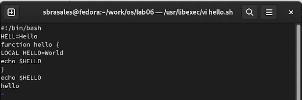
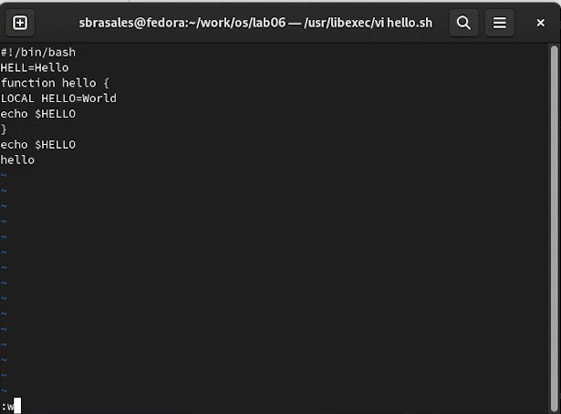
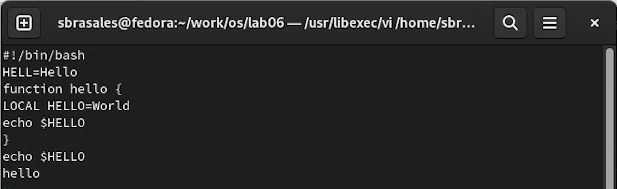
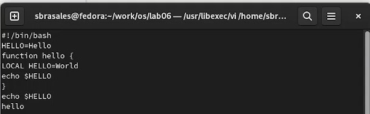
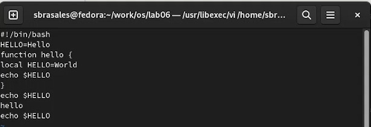
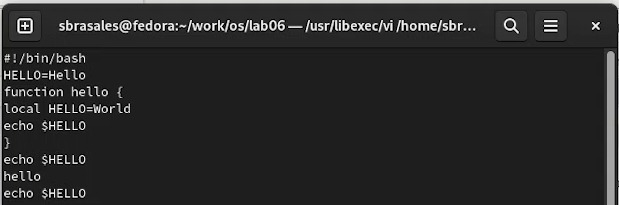
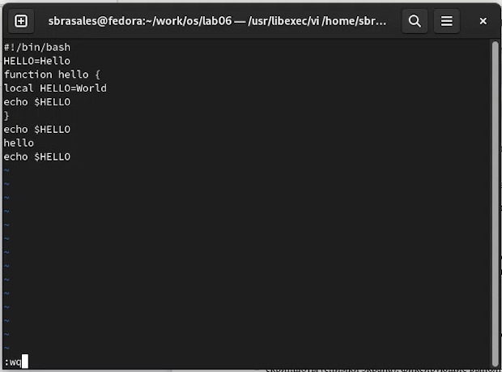

---
## Front matter
lang: ru-RU
title: Лабораторная работа № 8. 
subtitle:  Текстовой редактор vi
author:
  - Брасалес Сарасбати
institute:
  - Российский университет дружбы народов, Москва, Россия
date: 01/04/2023

## i18n babel
babel-lang: russian
babel-otherlangs: english

## Formatting pdf
toc: false
toc-title: Содержание
slide_level: 2
aspectratio: 169
section-titles: true
theme: metropolis
header-includes:
 - \metroset{progressbar=frametitle,sectionpage=progressbar,numbering=fraction}
 - '\makeatletter'
 - '\beamer@ignorenonframefalse'
 - '\makeatother'
---

# Информация

## Докладчик

:::::::::::::: {.columns align=center}
::: {.column width="70%"}

  * Сарасбати Брасалес
  * профессор кафедры прикладной информатики и теории вероятностей
  * Российский университет дружбы народов
 

:::
::: {.column width="30%"}


:::
::::::::::::::

# введение

## Цели и задачи

Познакомиться с операционной системой Linux. Получить практические навыки работы с редактором vi, установленным по умолчанию практически во всех дистрибутивах.

## задание

Задание 1. Создание нового файла с использованием vi

Создайте каталог с именем ~/work/os/lab06.

Перейдите во вновь созданный каталог.

Вызовите vi и создайте файл hello.sh

Нажмите клавишу i и вводите текст.

Нажмите клавишу Esc для перехода в командный режим после завершения ввода текста.

Нажмите : для перехода в режим последней строки и внизу вашего экрана появится приглашение в виде двоеточия.

Нажмите w (записать) и q (выйти), а затем нажмите клавишу Enter для сохранения вашего текста и завершения работы.

Сделайте файл исполняемым

## задание

Задание 2. Редактирование существующего файла

Вызовите vi на редактирование файла

Установите курсор в конец слова HELL второй строки.

Перейдите в режим вставки и замените на HELLO. Нажмите Esc для возврата в командный режим.

Установите курсор на четвертую строку и сотрите слово LOCAL.

Перейдите в режим вставки и наберите следующий текст: local, нажмите Esc для возврата в командный режим.

Установите курсор на последней строке файла. Вставьте после неё строку, содержащую следующий текст: echo $HELLO.

Нажмите Esc для перехода в командный режим.

Удалите последнюю строку.

Введите команду отмены изменений u для отмены последней команды.

Введите символ : для перехода в режим последней строки. Запишите произведённые изменения и выйдите из vi.


# Выполнение работы

## Набор текста



## Сохранение и закрытие редактора



## Замена слова



## Удаление слова



## Написание нового слова



## Вставка текста после последней строки


## Удаление строки и отмена операции



## Сохранение и выход из редактора



## Код для формата `pdf`

```yaml
slide_level: 2
aspectratio: 169
section-titles: true
theme: metropolis
```

## Формат `html`

- Используется фреймворк [reveal.js](https://revealjs.com/)
- Используется [тема](https://revealjs.com/themes/) `beige`

## Код для формата `html`

- Тема задаётся в файле `Makefile`

```make
REVEALJS_THEME = beige 
```
# Выводы

## Выводы

Мы познакомились с операционной системой Linuxи получили практические навыки работы с редактором vi, установленным по умолчанию практически во всех дистрибутивах.


## Представление данных

::: incremental

- Лучше представить в виде схемы
- Менее оптимально представить в виде рисунка, графика, таблицы
- Текст используется, если все предыдущие способы отображения информации не подошли

:::

