---
## Front matter
title: "Лабораторная работа No 8. "
subtitle: "Текстовой редактор vi"
author: "Сарасбати Брасалес Вивас"

## Generic otions
lang: ru-RU
toc-title: "Содержание"

## Bibliography
bibliography: bib/cite.bib
csl: pandoc/csl/gost-r-7-0-5-2008-numeric.csl

## Pdf output format
toc: true # Table of contents
toc-depth: 2
lof: true # List of figures
lot: true # List of tables
fontsize: 12pt
linestretch: 1.5
papersize: a4
documentclass: scrreprt
## I18n polyglossia
polyglossia-lang:
  name: russian
  options:
	- spelling=modern
	- babelshorthands=true
polyglossia-otherlangs:
  name: english
## I18n babel
babel-lang: russian
babel-otherlangs: english
## Fonts
mainfont: PT Serif
romanfont: PT Serif
sansfont: PT Sans
monofont: PT Mono
mainfontoptions: Ligatures=TeX
romanfontoptions: Ligatures=TeX
sansfontoptions: Ligatures=TeX,Scale=MatchLowercase
monofontoptions: Scale=MatchLowercase,Scale=0.9
## Biblatex
biblatex: true
biblio-style: "gost-numeric"
biblatexoptions:
  - parentracker=true
  - backend=biber
  - hyperref=auto
  - language=auto
  - autolang=other*
  - citestyle=gost-numeric
## Pandoc-crossref LaTeX customization
figureTitle: "Рис."
tableTitle: "Таблица"
listingTitle: "Листинг"
lofTitle: "Список иллюстраций"
lotTitle: "Список таблиц"
lolTitle: "Листинги"
## Misc options
indent: true
header-includes:
  - \usepackage{indentfirst}
  - \usepackage{float} # keep figures where there are in the text
  - \floatplacement{figure}{H} # keep figures where there are in the text
---

# Цель работы

Познакомиться с операционной системой Linux. Получить практические навыки рабо-
ты с редактором vi, установленным по умолчанию практически во всех дистрибутивах.

# Задание

Задание 1. Создание нового файла с использованием vi
1. Создайте каталог с именем ~/work/os/lab06.
2. Перейдите во вновь созданный каталог.
3. Вызовите vi и создайте файл hello.sh
4. Нажмите клавишу i и вводите следующий текст.
5. Нажмите клавишу Esc для перехода в командный режим после завершения ввода
текста.
6. Нажмите : для перехода в режим последней строки и внизу вашего экрана появится
приглашение в виде двоеточия.
7. Нажмите w (записать) и q (выйти), а затем нажмите клавишу Enter для сохранения
вашего текста и завершения работы.
8. Сделайте файл исполняемым

Задание 2. Редактирование существующего файла
1. Вызовите vi на редактирование файла
2. Установите курсор в конец слова HELL второй строки.
3. Перейдите в режим вставки и замените на HELLO. Нажмите Esc для возврата в команд-
ный режим.
4. Установите курсор на четвертую строку и сотрите слово LOCAL.
5. Перейдите в режим вставки и наберите следующий текст: local, нажмите Esc для
возврата в командный режим.
6. Установите курсор на последней строке файла. Вставьте после неё строку, содержащую
следующий текст: echo $HELLO.
7. Нажмите Esc для перехода в командный режим
8. Удалите последнюю строку.
9. Введите команду отмены изменений u для отмены последней команды.
10. Введите символ : для перехода в режим последней строки. Запишите произведённые
изменения и выйдите из vi.

# Теоретическое введение

В большинстве дистрибутивов Linux в качестве текстового редактора по умолчанию
устанавливается интерактивный экранный редактор vi (Visual display editor).
Редактор vi имеет три режима работы:
– командный режим — предназначен для ввода команд редактирования и навигации по
редактируемому файлу;
– режим вставки — предназначен для ввода содержания редактируемого файла;
– режим последней (или командной) строки — используется для записи изменений в файл
и выхода из редактора.
Для вызова редактора vi необходимо указать команду vi и имя редактируемого файла:
vi <имя_файла>
При этом в случае отсутствия файла с указанным именем будет создан такой файл.
Переход в командный режим осуществляется нажатием клавиши Esc . Для выхода из
редактора vi необходимо перейти в режим последней строки: находясь в командном
режиме, нажать Shift-; (по сути символ : — двоеточие), затем:
 набрать символы wq, если перед выходом из редактора требуется записать изменения
в файл;
– набрать символ q (или q!), если требуется выйти из редактора без сохранения.
Замечание. Следует помнить, что vi различает прописные и строчные буквы при наборе
(восприятии) команд.

# Выполнение лабораторной работы

В качестве первого шага я создала каталог "", а затем вошла в него(рис. @fig:001).

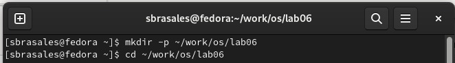{#fig:001 width=70%}

Затем я использовал текстовый редактор vi и создал файл hello.sh. (рис. @fig:002)

{#fig:002 width=70%}

После в открывшемся файле я нажала клавишу i и набрала нужный текст

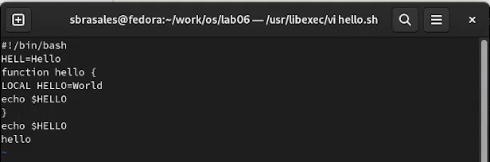{#fig:003 width=70%}

Затем я нажала клавишу Esc, чтобы войти в командный режим, я нажала :, чтобы войти в последнюю строку. Я написала w и q, чтобы сохранить изменения

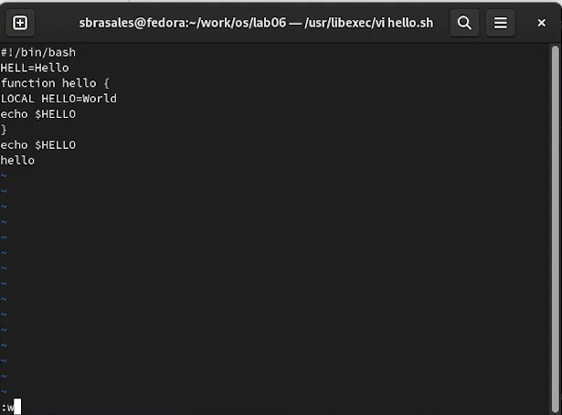{#fig:004 width=70%}

Сделала файл командой ""

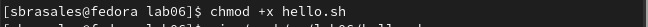{#fig:005 width=70%}

Я открыла файл в текстовом редакторе vi

{#fig:006 width=70%}

После с помощью комбинации 2 G я перешла на вторую строку текста
Далее я с помощью а перешла в режим вставки и заменила искомое слово на "HELLO". 

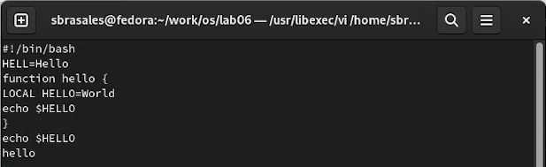{#fig:007 width=70%}

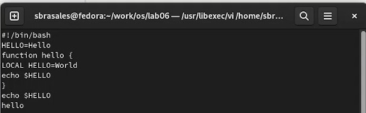{#fig:008 width=70%}

Я стерла слово "LOCAL" комбинацией d w. 

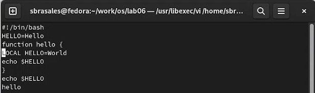{#fig:009 width=70%}

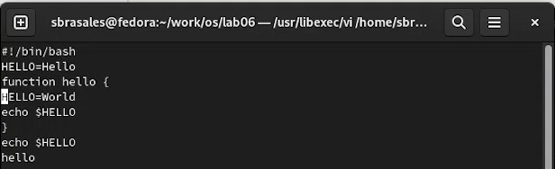{#fig:010 width=70%}

После я написала слово "local", с помощью а перейдя в режим вставки.

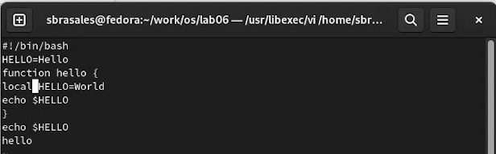{#fig:011 width=70%}

я написала текст "echo $HELLO" использовав o, чтобы вставлять текст ниже курсора, 

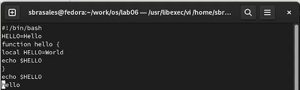{#fig:012 width=70%}

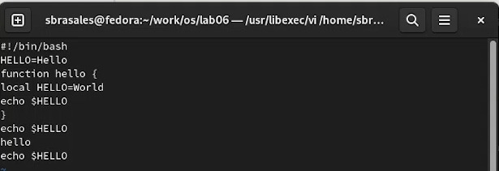{#fig:013 width=70%}

Использовав d d, удалила набранную строку.А после вернула ее клавишей u, служащей для отмены последней операции.

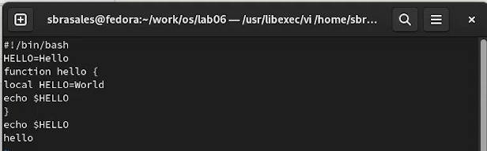{#fig:014 width=70%}
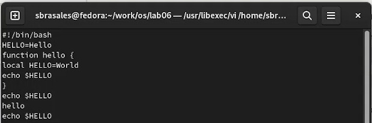{#fig:015 width=70%}

Я написала : для перехода в режим последней строки и сохранил изменения

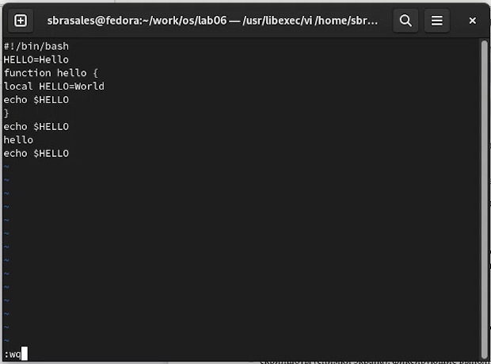{#fig:016 width=70%}

# Выводы

Мы познакомились с операционной системой Linuxи получили практические навыки работы с редактором vi, установленным по умолчанию практически во всех дистрибутивах.

# Контрольные вопросы

    1. Дайте краткую характеристику режимам работы редактора vi.
Редактор vi имеет три режима работы:
– командный режим — предназначен для ввода команд редактирования и навигации по редактируемому файлу;

– режим вставки — предназначен для ввода содержания редактируемого файла;

– режим последней (или командной) строки — используется для записи изменений в файл и выхода из редактора.
    2. Как выйти из редактора, не сохраняя произведённые изменения?
Нужно просто перейти в режим командной строки и нажать q (или q!), после Enter.
    3. Назовите и дайте краткую характеристику командам позиционирования.
       – 0 (ноль) — переход в начало строки;
       – $ — переход в конец строки;
       – G — переход в конец файла;
       – n G — переход на строку с номером n
    4. Что для редактора vi является словом?
Слово - строка символов, которая может состоять из букв, цифр и символов подчеркивания.
    5. Каким образом из любого места редактируемого файла перейти в начало (конец) файла?
В начало файла можно перйти комбинацией 1 G, а в конец клавишей G.
    6. Назовите и дайте краткую характеристику основным группам команд редактирования.
Вставка текста:
– а — вставить текст после курсора;

– А — вставить текст в конец строки;

– i — вставить текст перед курсором;

– 𝑛 i — вставить текст 𝑛 раз;

– I — вставить текст в начало строки.
Вставка строки:
– о — вставить строку под курсором;

– О — вставить строку над курсором.
Удаление текста:
– x — удалить один символ в буфер;

– d w — удалить одно слово в буфер;

– d $ — удалить в буфер текст от курсора до конца строки;

– d 0 — удалить в буфер текст от начала строки до позиции курсора;

– d d — удалить в буфер одну строку;

– n d d — удалить в буфер n строк.
Отмена и повтор произведённых изменений:
– u — отменить последнее изменение;

– . — повторить последнее изменение.
Копирование текста в буфер:
– Y — скопировать строку в буфер;

– 𝑛 Y — скопировать 𝑛 строк в буфер;

– y w — скопировать слово в буфер.
Вставка текста из буфера:
– p — вставить текст из буфера после курсора;

– P — вставить текст из буфера перед курсором.
Замена текста:
– c w — заменить слово;

– 𝑛 c w — заменить 𝑛 слов;

– c $ — заменить текст от курсора до конца строки;

– r — заменить слово;

– R — заменить текст.
Поиск текста:
– / текст — произвести поиск вперёд по тексту указанной строки символов текст;

– ? текст — произвести поиск назад по тексту указанной строки символов текст.
    7. Необходимо заполнить строку символами $. Каковы ваши действия?
Вначале перходим в режим вставки (a), а после заполняем строку нужными символами.
    8. Как отменить некорректное действие, связанное с процессом редактирования?
Клавиша u отменяет последнее сделанное действие
    9. Назовите и дайте характеристику основным группам команд режима последней строки.
Копирование и перемещение текста:
– : 𝑛,𝑚 d — удалить строки с 𝑛 по 𝑚;

– : 𝑖,𝑗 m 𝑘 — переместить строки с 𝑖 по 𝑗, начиная со строки 𝑘;

– : 𝑖,𝑗 t 𝑘 — копировать строки с 𝑖 по 𝑗 в строку 𝑘;

– : 𝑖,𝑗 w имя-файла — записать строки с 𝑖 по 𝑗 в файл с именем имя-файла.
Запись в файл и выход из редактора:
– : w — записать изменённый текст в файл, не выходя из vi;

– : w имя-файла — записать изменённый текст в новый файл с именем имя-файла;

– : w ! имя-файла — записать изменённый текст в файл с именем имя-файла;

– : w q — записать изменения в файл и выйти из vi;

– : q — выйти из редактора vi;

– : q ! — выйти из редактора без записи;

– : e ! — вернуться в командный режим, отменив все изменения, произведённые со времени последней записи.
    10. Как определить, не перемещая курсора, позицию, в которой заканчивается строка?
Знак $ перемещает курсор в конец строки.
    11. Выполните анализ опций редактора vi (сколько их, как узнать их назначение и т.д.).
Опции редактора vi позволяют настроить рабочую среду. Для задания опций используется команда set (в режиме последней строки):
– : set all — вывести полный список опций;

– : set nu — вывести номера строк;

– : set list — вывести невидимые символы;

– : set ic — не учитывать при поиске, является ли символ прописным или строчным.
Если вы хотите отказаться от использования опции, то в команде set перед именем опции надо поставить no.
    12. Как определить режим работы редактора vi?
Нажатие клавиши Esc всегда переводит редактор в режим командной строки. Если вы уже находитесь в этом режиме, то компьютер напомнит вам об этом. Этот режим универслаен и удобен, если вы не помните, в каком режиме находились.
    13. Постройте граф взаимосвязи режимов работы редактора vi.
Командный режим -> Режим вставки -> Режим командной строки

# Список литературы{.unnumbered}

::: {#refs}
:::
