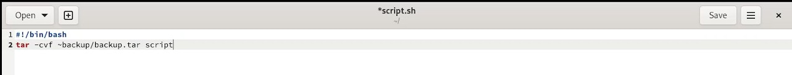
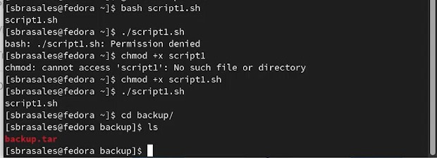
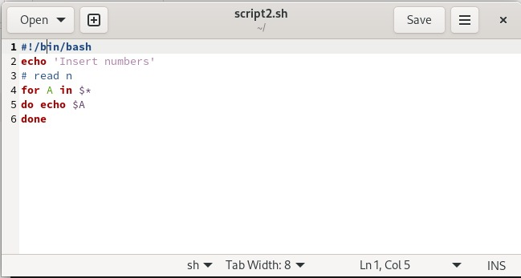
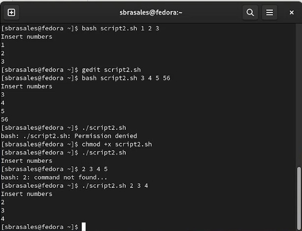
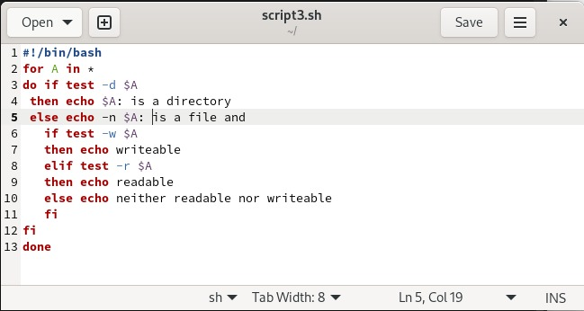
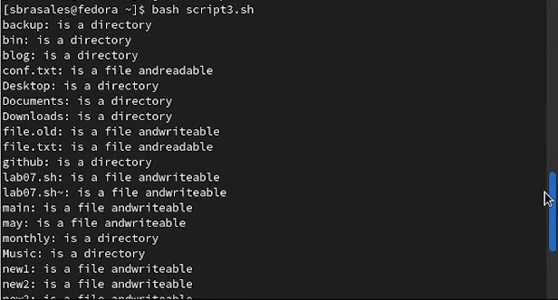
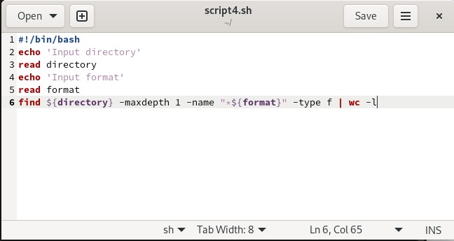
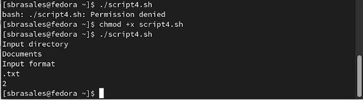

---
## Front matter
title: "Лабораторная работа No 10. "
subtitle: "Программирование в командном
процессоре ОС UNIX. Командные файлы"
author: "Сарасбати Брасалес"

## Generic otions
lang: ru-RU
toc-title: "Содержание"

## Bibliography
bibliography: bib/cite.bib
csl: pandoc/csl/gost-r-7-0-5-2008-numeric.csl

## Pdf output format
toc: true # Table of contents
toc-depth: 2
lof: true # List of figures
lot: true # List of tables
fontsize: 12pt
linestretch: 1.5
papersize: a4
documentclass: scrreprt
## I18n polyglossia
polyglossia-lang:
  name: russian
  options:
	- spelling=modern
	- babelshorthands=true
polyglossia-otherlangs:
  name: english
## I18n babel
babel-lang: russian
babel-otherlangs: english
## Fonts
mainfont: PT Serif
romanfont: PT Serif
sansfont: PT Sans
monofont: PT Mono
mainfontoptions: Ligatures=TeX
romanfontoptions: Ligatures=TeX
sansfontoptions: Ligatures=TeX,Scale=MatchLowercase
monofontoptions: Scale=MatchLowercase,Scale=0.9
## Biblatex
biblatex: true
biblio-style: "gost-numeric"
biblatexoptions:
  - parentracker=true
  - backend=biber
  - hyperref=auto
  - language=auto
  - autolang=other*
  - citestyle=gost-numeric
## Pandoc-crossref LaTeX customization
figureTitle: "Рис."
tableTitle: "Таблица"
listingTitle: "Листинг"
lofTitle: "Список иллюстраций"
lotTitle: "Список таблиц"
lolTitle: "Листинги"
## Misc options
indent: true
header-includes:
  - \usepackage{indentfirst}
  - \usepackage{float} # keep figures where there are in the text
  - \floatplacement{figure}{H} # keep figures where there are in the text
---

# Цель работы

Изучить основы программирования в оболочке ОС UNIX/Linux. Научиться писать
небольшие командные файлы

# Задание

1. Написать скрипт, который при запуске будет делать резервную копию самого себя (то
есть файла, в котором содержится его исходный код) в другую директорию backup
в вашем домашнем каталоге. При этом файл должен архивироваться одним из ар-
хиваторов на выбор zip, bzip2 или tar. Способ использования команд архивации
необходимо узнать, изучив справку.
2. Написать пример командного файла, обрабатывающего любое произвольное число
аргументов командной строки, в том числе превышающее десять. Например, скрипт
может последовательно распечатывать значения всех переданных аргументов.
3. Написать командный файл — аналог команды ls (без использования самой этой ко-
манды и команды dir). Требуется, чтобы он выдавал информацию о нужном каталоге
и выводил информацию о возможностях доступа к файлам этого каталога.
4. Написать командный файл, который получает в качестве аргумента командной строки
формат файла (.txt, .doc, .jpg, .pdf и т.д.) и вычисляет количество таких файлов
в указанной директории. Путь к директории также передаётся в виде аргумента ко-
мандной строки.

# Теоретическое введение

Командные процессоры (оболочки)
Командный процессор (командная оболочка, интерпретатор команд shell) — это про-
грамма, позволяющая пользователю взаимодействовать с операционной системой
компьютера. В операционных системах типа UNIX/Linux наиболее часто используются
следующие реализации командных оболочек:
– оболочка Борна (Bourne shell или sh) — стандартная командная оболочка UNIX/Linux,
содержащая базовый, но при этом полный набор функций;
– С-оболочка (или csh) — надстройка на оболочкой Борна, использующая С-подобный
синтаксис команд с возможностью сохранения истории выполнения команд;
– оболочка Корна (или ksh) — напоминает оболочку С, но операторы управления програм-
мой совместимы с операторами оболочки Борна;
– BASH — сокращение от Bourne Again Shell (опять оболочка Борна), в основе своей сов-
мещает свойства оболочек С и Корна (разработка компании Free Software Foundation).
POSIX (Portable Operating System Interface for Computer Environments) — набор стандартов
описания интерфейсов взаимодействия операционной системы и прикладных программ.
Стандарты POSIX разработаны комитетом IEEE (Institute of Electrical and Electronics
Engineers) для обеспечения совместимости различных UNIX/Linux-подобных опера-
ционных систем и переносимости прикладных программ на уровне исходного кода.
POSIX-совместимые оболочки разработаны на базе оболочки Корна.
Рассмотрим основные элементы программирования в оболочке bash. В других оболоч-
ках большинство команд будет совпадать с описанными ниже.

Использование арифметических вычислений. Операторы let
и read
Оболочка bash поддерживает встроенные арифметические функции. Команда let
является показателем того, что последующие аргументы представляют собой выражение,
подлежащее вычислению. Простейшее выражение — это единичный терм (term), обычно
целочисленный.
Целые числа можно записывать как последовательность цифр или в любом базовом
формате типа radix\#number, где radix (основание системы счисления) — любое чис-
ло не более 26. Для большинства команд используются следующие основания систем
исчисления: 2 (двоичная), 8 (восьмеричная) и 16 (шестнадцатеричная). Простейшими
математическими выражениями являются сложение (+), вычитание (-), умножение (*),
целочисленное деление (/) и целочисленный остаток от деления (%).
Команда let берет два операнда и присваивает их переменной. Положительным мо-
ментом команды let можно считать то, что для идентификации переменной ей не
нужен знак доллара; вы можете писать команды типа let sum=x+7, и let будет искать
переменную x и добавлять к ней 7.
Команда let также расширяет другие выражения let, если они заключены в двойные
круглые скобки. Таким способом вы можете создавать довольно сложные выражения.
Команда let не ограничена простыми арифметическими выражениями. Табл. 10.1
показывает полный набор let-операций.
Подобно С оболочка bash может присваивать переменной любое значение, а произволь-
ное выражение само имеет значение, которое может использоваться. При этом «ноль»
воспринимается как «ложь», а любое другое значение выражения — как «истина»

# Выполнение лабораторной работы

Скрипт 1 (рис. @fig:001) рис. @fig:002).

{#fig:001 width=70%}

{#fig:002 width=70%}

Скрипт 2 (рис. @fig:003) рис. @fig:004).

{#fig:003 width=70%}

{#fig:004 width=70%}

Скрипт 3 (рис. @fig:005) (рис. @fig:006).

{#fig:005 width=70%}

{#fig:006 width=70%}

Скрипт 4 (рис. @fig:007) (рис. @fig:008).

{#fig:007 width=70%}

{#fig:008 width=70%}

# Выводы

Мы изучили основы программирования в оболочке ОС UNIX/Linux и научились писать небольшие командные файлы.

# Контрольные вопросы

    1. Объясните понятие командной оболочки. Приведите примеры командных оболочек. Чем они отличаются?
Командный процессор (командная оболочка, интерпретатор команд shell) — это программа, позволяющая пользователю взаимодействовать с операционной системой компьютера. В операционных системах типа UNIX/Linux наиболее часто используются следующие реализации командных оболочек:
– оболочка Борна (Bourne shell или sh) — стандартная командная оболочка UNIX/Linux, содержащая базовый, но при этом полный набор функций;
– С-оболочка (или csh) — надстройка на оболочкой Борна, использующая С-подобный синтаксис команд с возможностью сохранения истории выполнения команд;
– оболочка Корна (или ksh) — напоминает оболочку С, но операторы управления программой совместимы с операторами оболочки Борна;
– BASH — сокращение от Bourne Again Shell (опять оболочка Борна), в основе своей совмещает свойства оболочек С и Корна (разработка компании Free Software Foundation)
    2. Что такое POSIX?
POSIX (Portable Operating System Interface for Computer Environments) — набор стандартов описания интерфейсов взаимодействия операционной системы и прикладных программ. Стандарты POSIX разработаны комитетом IEEE (Institute of Electrical and Electronics Engineers) для обеспечения совместимости различных UNIX/Linux-подобных операционных систем и переносимости прикладных программ на уровне исходного кода. POSIX-совместимые оболочки разработаны на базе оболочки Корна. Рассмотрим основные элементы программирования в оболочке bash. В других оболочках большинство команд будет совпадать с описанными ниже.
    3. Как определяются переменные и массивы в языке программирования bash?
Командный процессор bash обеспечивает возможность использования переменных типа строка символов. Имена переменных могут быть выбраны пользователем. Пользователь имеет возможность присвоить переменной значение некоторой строки символов.
Например, команда mark=/usr/andy/bin присваивает значение строки символов /usr/andy/bin переменной mark типа строка символов.
Значение, присвоенное некоторой переменной, может быть впоследствии использовано. Для этого в соответствующем месте командной строки должно быть употреблено имя этой переменной, которому предшествует метасимвол $.
Использование значения, присвоенного некоторой переменной, называется подстановкой. Для того чтобы имя переменной не сливалось с символами, которые могут следовать за ним в командной строке, при подстановке в общем случае используется следующая форма записи: ${имя переменной}. Например, использование команд
b=/tmp/andy2
ls -l myfile > ${b}lssudo apt-get install texlive-luatex
приведёт к переназначению стандартного вывода команды ls с терминала на файл /tmp/andy-ls, а использование команды ls -l>$bls приведёт к подстановке в командную строку значения переменной bls. Если переменной bls не было предварительно присвоено никакого значения, то её значением будет символ пробела.
Оболочка bash позволяет работать с массивами. Для создания массива используется команда set с флагом -A. За флагом следует имя переменной, а затем список значений, разделённых пробелами. Например, set -A states Delaware Michigan "New Jersey"
Далее можно сделать добавление в массив, например,states[49]=Alaska. Индексация массивов начинается с нулевого элемента.
    4. Каково назначение операторов let и read?
let - команда, после которой аргументы представляют собой выражение, подлежащее вычислению.
read - команда, позволяющая читать перемнные, вводящиеся с компьютера.
    5. Какие арифметические операции можно применять в языке программирования bash?
Простейшими математическими выражениями являются сложение (+), вычитание (-), умножение (*), целочисленное деление (/) и целочисленный остаток от деления (%). Однако их намного больше
    6. Что означает операция (( ))?
Условия оболочки bush.
    7. Какие стандартные имена переменных Вам известны?
PATH; PS1; PS2; HOME; IFC; MAIL; TERM; LOGNAME
    8. Что такое метасимволы?
Такие символы, как ' < > * ? | \ " &, являются метасимволами и имеют для командного процессора специальный смысл.
    9. Как экранировать метасимволы?
Снятие специального смысла с метасимвола называется экранированием метасимвола. Экранирование может быть осуществлено с помощью предшествующего метасимволу символа , который, в свою очередь, является метасимволом. Для экранирования группы метасимволов нужно заключить её в одинарные кавычки. Строка, заключённая в двойные кавычки, экранирует все метасимволы, кроме $, ' , , "
    10. Как создавать и запускать командные файлы?
Нужно просто создать файл через touch,а затем сделать его исполняемым через chmod +x/название
    11. Как определяются функции в языке программирования bash?
Указать ключевое слово function, затем написать еее название и открыть фигурную скобку.
    12. Каким образом можно выяснить, является файл каталогом или обычным файлом?
Командой ls -lrt. Есть d, то каталог.
    13. Каково назначение команд set, typeset и unset?
set - установка перемнных оболочек и сред
unset - удаление переменной из командной оболочки
typeset - наложение ограничений на переменные
    14. Как передаются параметры в командные файлы?
При вызове командного файла на выполнение параметры ему могут быть переданы точно таким же образом, как и выполняемой программе. С точки зрения командного файла эти параметры являются позиционными. Символ $ является метасимволом командного процессора. Он используется, в частности, для ссылки на параметры, точнее, для получения их значений в командном файле. В командный файл можно передать до девяти параметров. При использовании где-либо в командном файле комбинации символов $i, где 0 < 𝑖 < 10, вместо неё будет осуществлена подстановка значения параметра с порядковым номером i, т.е. аргумента командного файла с порядковым номером i. Использование комбинации символов $0 приводит к подстановке вместо неё имени данного командного файла
    15. Назовите специальные переменные языка bash и их назначение.
При использовании в командном файле комбинации символов $# вместо неё будет осуществлена подстановка числа параметров, указанных в командной строке при вызове данного командного файла на выполнение.
Вот ещё несколько специальных переменных, используемых в командных файлах:
– $* — отображается вся командная строка или параметры оболочки;
– $? — код завершения последней выполненной команды;
– $$ — уникальный идентификатор процесса, в рамках которого выполняется командный процессор;
– $! — номер процесса, в рамках которого выполняется последняя вызванная на выполнение в командном режиме команда;
– $- — значение флагов командного процессора;
– ${name[n]} — обращение к n-му элементу массива;
– ${name[*]} — перечисляет все элементы массива, разделённые пробелом;
– ${name[@]} — то же самое, но позволяет учитывать символы пробелы в самих переменных;
– ${name:-value} — если значение переменной name не определено, то оно будет заменено на указанное value;
– ${name:value} — проверяется факт существования переменной;
– ${name=value} — если name не определено, то ему присваивается значение value;
– ${name?value} — останавливает выполнение, если имя переменной не определено, и выводит value как сообщение об ошибке;
– ${name+value} — это выражение работает противоположно ${name-value}. Если переменная определена, то подставляется value;
– ${name#pattern} — представляет значение переменной name с удалённым самым коротким левым образцом (pattern);

# Список литературы{.unnumbered}

::: {#refs}
:::
