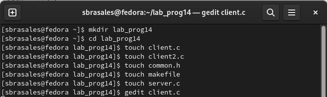
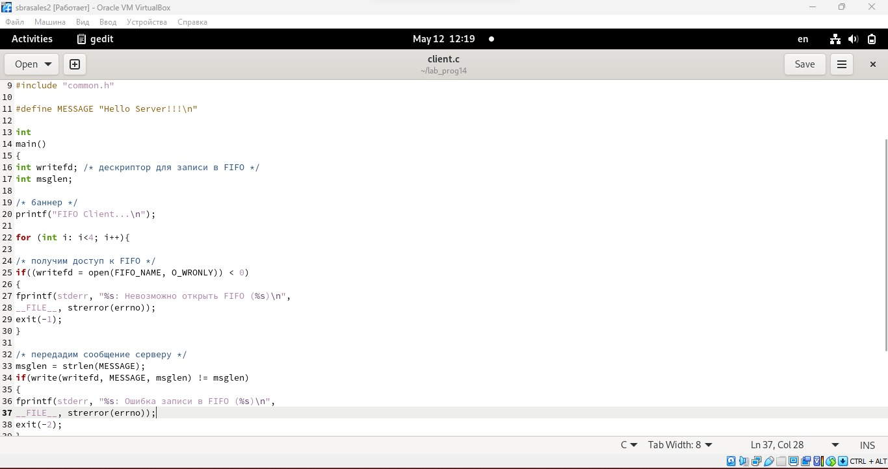
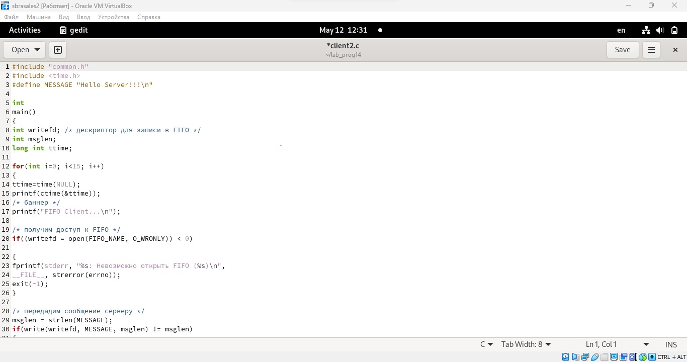
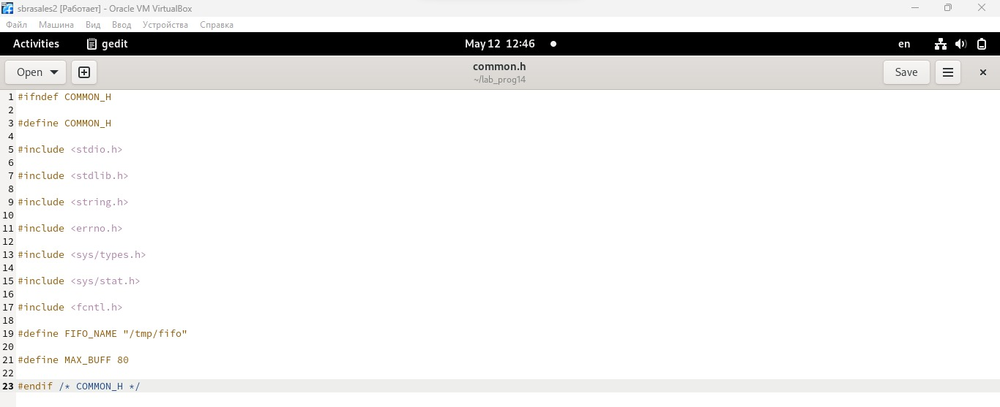
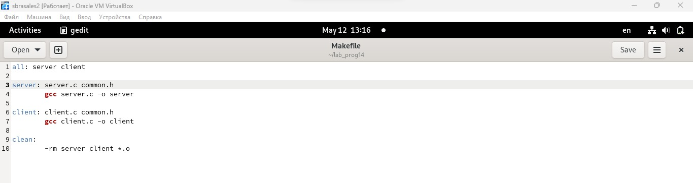
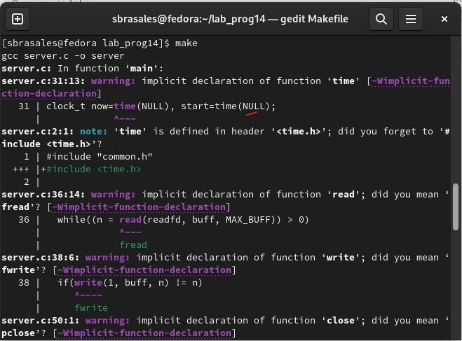

---
## Front matter
lang: ru-RU
title: Лабораторная работа No 14
subtitle: Именованные каналы
author:
  - Сарасбати Брасалес
institute:
  - Российский университет дружбы народов, Москва, Россия
date: 12/05/2023

## i18n babel
babel-lang: russian
babel-otherlangs: english

## Formatting pdf
toc: false
toc-title: Содержание
slide_level: 2
aspectratio: 169
section-titles: true
theme: metropolis
header-includes:
 - \metroset{progressbar=frametitle,sectionpage=progressbar,numbering=fraction}
 - '\makeatletter'
 - '\beamer@ignorenonframefalse'
 - '\makeatother'
---

# Информация

## Докладчик

:::::::::::::: {.columns align=center}
::: {.column width="70%"}

  * Сарасбати Брасалес
  * Российский университет дружбы народов
  * [sarasbati2904@gmail.com](sarasbati2904@gmail.com)

:::
::: {.column width="30%"}


:::
::::::::::::::

# Вводная часть

## Цель работы

Приобретение практических навыков работы с именованными каналами.

## Задание

Изучите приведённые в тексте программы server.c и client.c. Взяв данные примеры
за образец, напишите аналогичные программы, внеся следующие изменения:
1. Работает не 1 клиент, а несколько (например, два).
2. Клиенты передают текущее время с некоторой периодичностью (например, раз в пять
секунд). Используйте функцию sleep() для приостановки работы клиента.
3. Сервер работает не бесконечно, а прекращает работу через некоторое время (напри-
мер, 30 сек). Используйте функцию clock() для определения времени работы сервера.

# Выполнение лабораторной работы

## Программы в папке



## client.c



## client2.c



## common.h



## Makefile



## Makefile



## Вывод

## Вывод

Мы приобрели практические навыки работы с именованными каналами.


## Код для формата `pdf`

```yaml
slide_level: 2
aspectratio: 169
section-titles: true
theme: metropolis
```

:::

