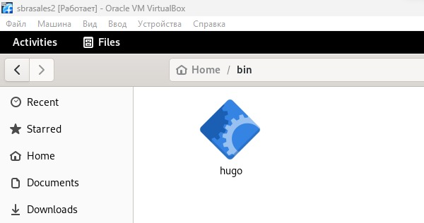
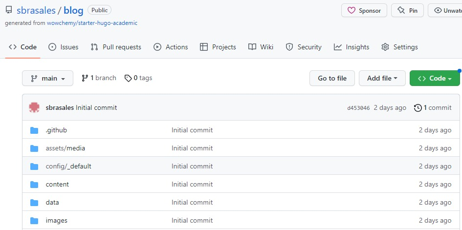
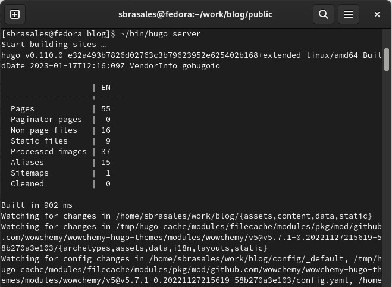
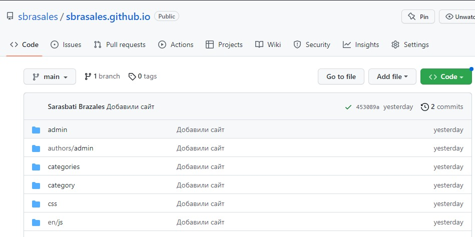
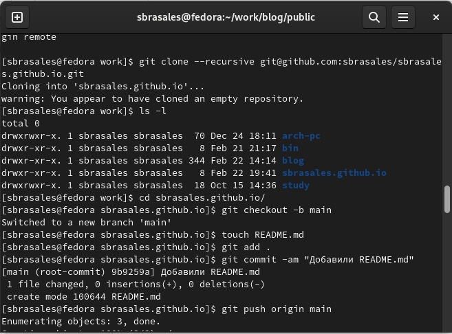
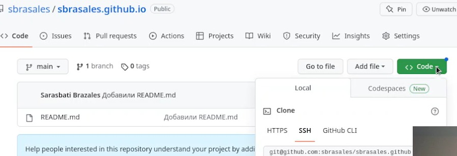
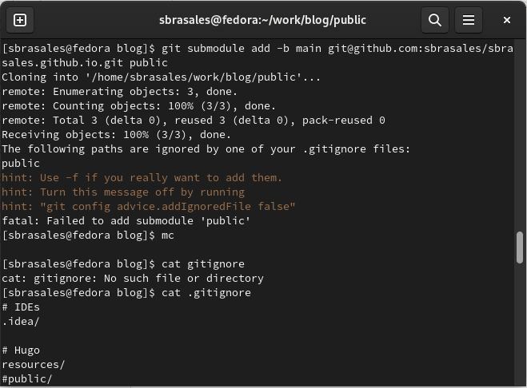
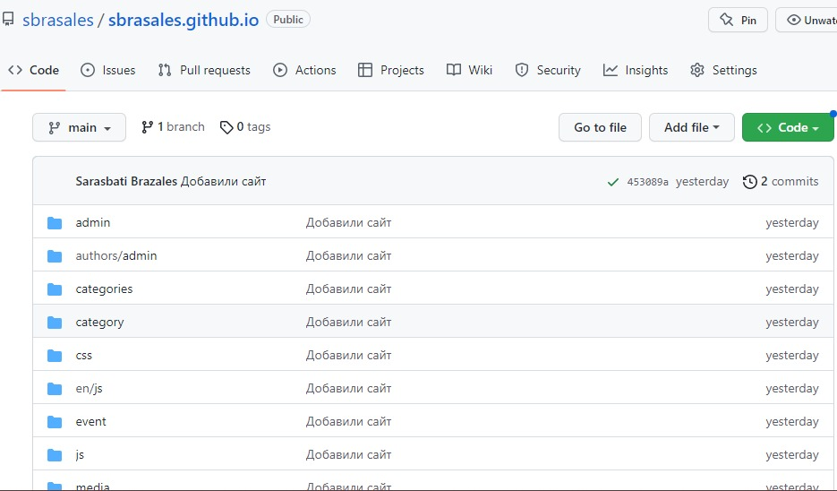
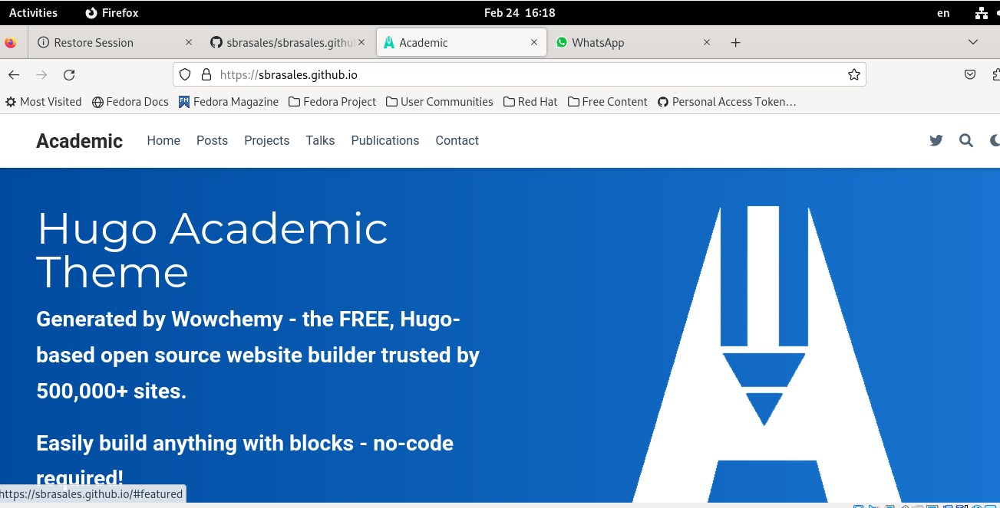

---
## Front matter
title: "Отчёт о выполнении. Индивидуальный проект."
subtitle: "Этап 1"
author: "Брасалес Вивас Сарасбати Даниэла"

## Generic otions
lang: ru-RU
toc-title: "Содержание"

## Bibliography
bibliography: bib/cite.bib
csl: pandoc/csl/gost-r-7-0-5-2008-numeric.csl

## Pdf output format
toc: true # Table of contents
toc-depth: 2
lof: true # List of figures
lot: true # List of tables
fontsize: 12pt
linestretch: 1.5
papersize: a4
documentclass: scrreprt
## I18n polyglossia
polyglossia-lang:
  name: russian
  options:
	- spelling=modern
	- babelshorthands=true
polyglossia-otherlangs:
  name: english
## I18n babel
babel-lang: russian
babel-otherlangs: english
## Fonts
mainfont: PT Serif
romanfont: PT Serif
sansfont: PT Sans
monofont: PT Mono
mainfontoptions: Ligatures=TeX
romanfontoptions: Ligatures=TeX
sansfontoptions: Ligatures=TeX,Scale=MatchLowercase
monofontoptions: Scale=MatchLowercase,Scale=0.9
## Biblatex
biblatex: true
biblio-style: "gost-numeric"
biblatexoptions:
  - parentracker=true
  - backend=biber
  - hyperref=auto
  - language=auto
  - autolang=other*
  - citestyle=gost-numeric
## Pandoc-crossref LaTeX customization
figureTitle: "Рис."
tableTitle: "Таблица"
listingTitle: "Листинг"
lofTitle: "Список иллюстраций"
lotTitle: "Список таблиц"
lolTitle: "Листинги"
## Misc options
indent: true
header-includes:
  - \usepackage{indentfirst}
  - \usepackage{float} # keep figures where there are in the text
  - \floatplacement{figure}{H} # keep figures where there are in the text
---

# Цель работы

Размещение на Github pages заготовки для персонального сайта.

# Задание

Установить необходимое программное обеспечение.
Скачать шаблон темы сайта.
Разместить его на хостинге git.
Установить параметр для URLs сайта.
Разместить заготовку сайта на Github pages.

# Выполнение лабораторной работы

Cкачайте "hugo" и переместите его в созданную папку "bin" (рис. @fig:001).

{#fig:001 width=70%}

Cоздать новый репозиторий «блог» (рис. @fig:002).

{#fig:002 width=70%}

B репозитории "блог" ~/bin/hugo (рис. @fig:003)

{#fig:003 width=70%}

{#fig:004 width=70%}

Cоздать новый репозиторий "sbrasales.github.io" (рис. @fig:005) 

{#fig:005 width=70%}

Cоздать README.md (рис. @fig:006)

{#fig:006 width=70%}

{#fig:007 width=70%}

исправить (рис. @fig:008)

{#fig:008 width=70%}

мы обновляем репозиторий (рис. @fig:009)

{#fig:009 width=70%}

мы просматриваем наш сайт (рис. @fig:0010)

{#fig:0010 width=70%}
# Выводы

Мы можем изменить наш веб-сайт и предоставить другим доступ к нашему хранилищу.

# Список литературы{.unnumbered}

::: {#refs}
:::
