---
## Front matter
title: "Индивидуальный проект.Этап 2"
author: "Сарасбати Брасалес"

## Generic otions
lang: ru-RU
toc-title: "Содержание"

## Bibliography
bibliography: bib/cite.bib
csl: pandoc/csl/gost-r-7-0-5-2008-numeric.csl

## Pdf output format
toc: true # Table of contents
toc-depth: 2
lof: true # List of figures
lot: true # List of tables
fontsize: 12pt
linestretch: 1.5
papersize: a4
documentclass: scrreprt
## I18n polyglossia
polyglossia-lang:
  name: russian
  options:
	- spelling=modern
	- babelshorthands=true
polyglossia-otherlangs:
  name: english
## I18n babel
babel-lang: russian
babel-otherlangs: english
## Fonts
mainfont: PT Serif
romanfont: PT Serif
sansfont: PT Sans
monofont: PT Mono
mainfontoptions: Ligatures=TeX
romanfontoptions: Ligatures=TeX
sansfontoptions: Ligatures=TeX,Scale=MatchLowercase
monofontoptions: Scale=MatchLowercase,Scale=0.9
## Biblatex
biblatex: true
biblio-style: "gost-numeric"
biblatexoptions:
  - parentracker=true
  - backend=biber
  - hyperref=auto
  - language=auto
  - autolang=other*
  - citestyle=gost-numeric
## Pandoc-crossref LaTeX customization
figureTitle: "Рис."
tableTitle: "Таблица"
listingTitle: "Листинг"
lofTitle: "Список иллюстраций"
lotTitle: "Список таблиц"
lolTitle: "Листинги"
## Misc options
indent: true
header-includes:
  - \usepackage{indentfirst}
  - \usepackage{float} # keep figures where there are in the text
  - \floatplacement{figure}{H} # keep figures where there are in the text
---

# Цель работы

Добавить к сайту данные о себе и научиться добавлять посты.

# Задание

Добавить к сайту данные о себе.

    Список добавляемых данных.
        Разместить фотографию владельца сайта.
        Разместить краткое описание владельца сайта (Biography).
        Добавить информацию об интересах (Interests).
        Добавить информацию от образовании (Education).
    Сделать пост по прошедшей неделе.
    Добавить пост на тему по выбору:
        Управление версиями. Git.
        Непрерывная интеграция и непрерывное развертывание (CI/CD).

# Теоретическое введение

# Выполнение лабораторной работы

В репозитории «блог» я нашла папку «contet/author/admin».
там я заменила изображение своим изображением (рис. [-@fig:001])и отредактировал файл со своей информацией (рис. [-@fig:002])

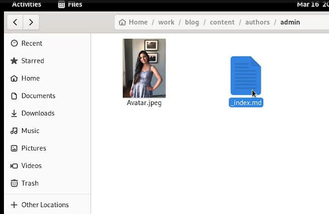{#fig:001 width=70%}

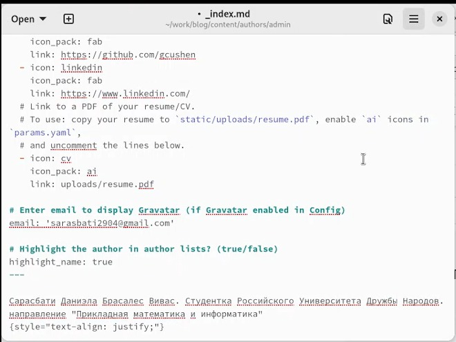{#fig:002 width=70%}

В папке «blog» я написалa «hugo new --kind post/post/ неделя1 », что позволило мне создать папку в «content/posts». (рис. [-@fig:003])

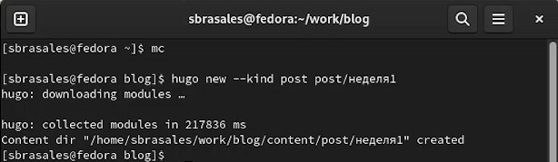{#fig:003 width=70%}

затем я открыла файл и отредактировала его с текстом. (рис. [-@fig:004])

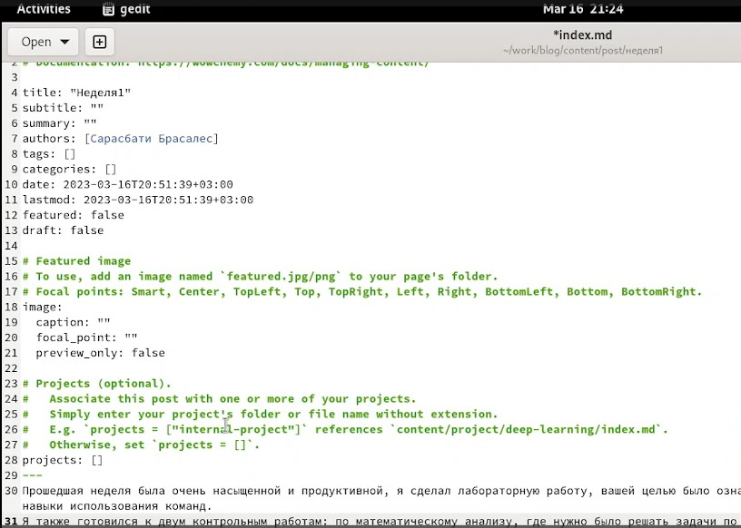{#fig:004 width=70%}

Я создала еще одну папку "Git" (рис. [-@fig:005]) и в файле написала текст поста.(рис. [-@fig:006])

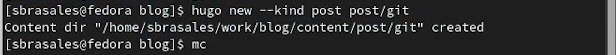{#fig:005 width=70%}

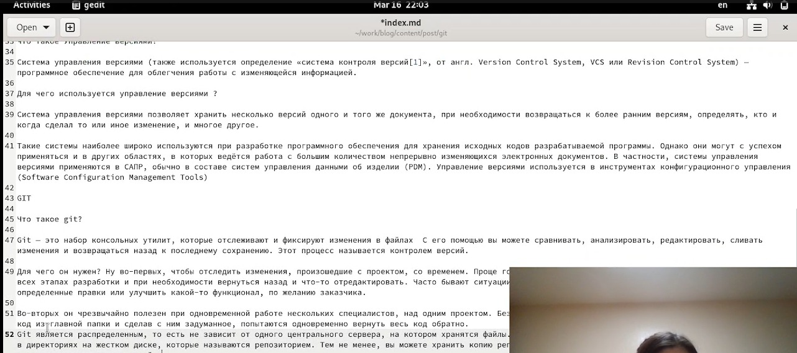{#fig:006 width=70%}

Потом я сохранила все изменения и написала "hugo". (рис. [-@fig:007])

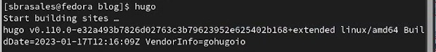{#fig:007 width=70%}

В папку "Public" я ввела три команды для переноса данных из локального репозитория. (рис. [-@fig:008])

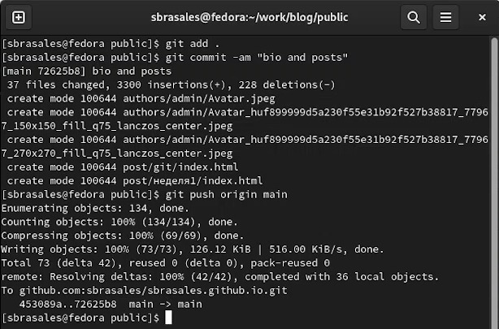{#fig:008 width=70%}

Повторила процесс в папке "blog". (рис. [-@fig:009])

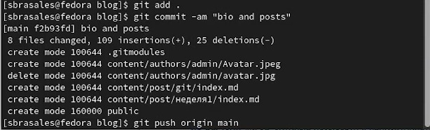{#fig:009 width=70%}

Я проверила изменения на сайте.(рис. [-@fig:010]) (рис. [-@fig:011])

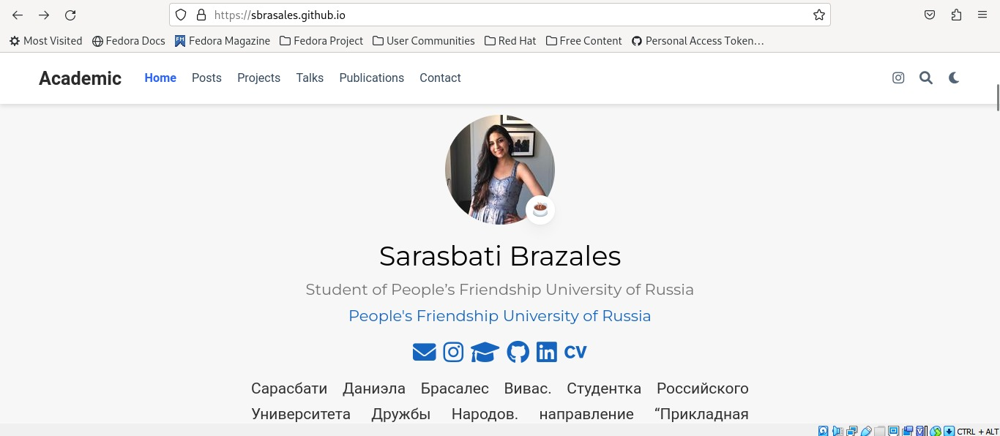{#fig:010 width=70%}

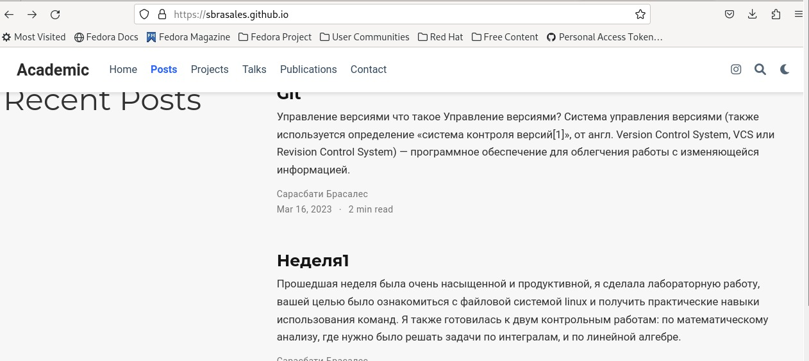{#fig:011 width=70%}

# Выводы

Мы добавили на сайт данные о себе и научились создавать посты. Добавили пост о прешедшей неделе и пост на тему "Управление версиями. Git"

# Список литературы{.unnumbered}

::: {#refs}
:::
