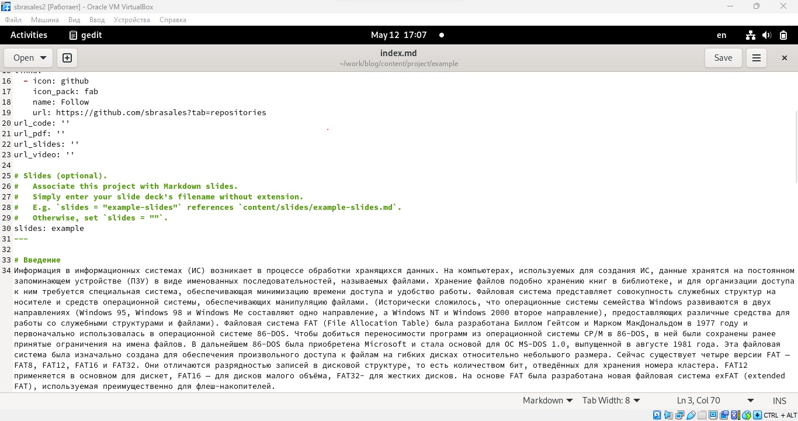
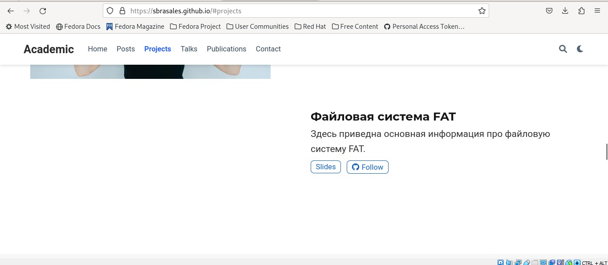
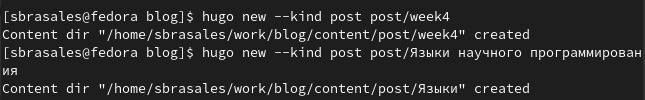
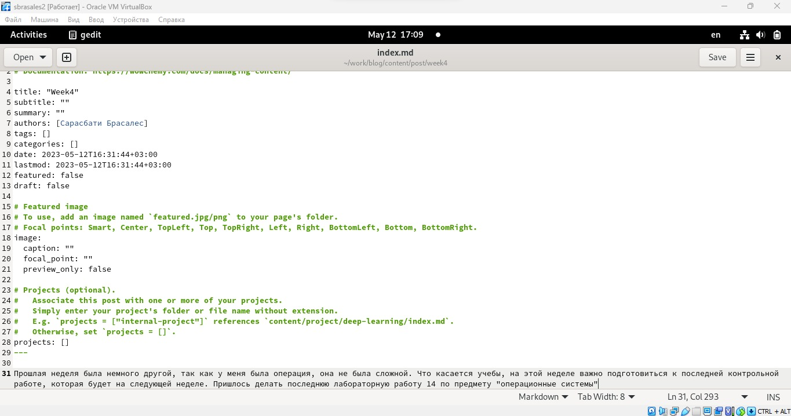
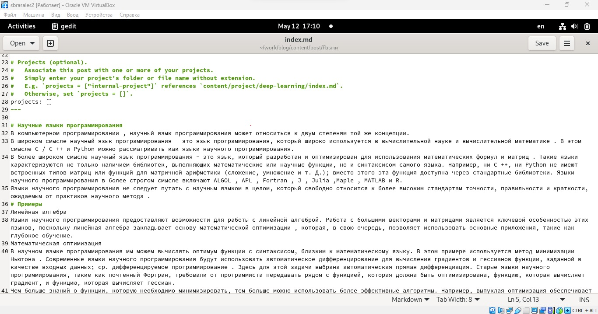
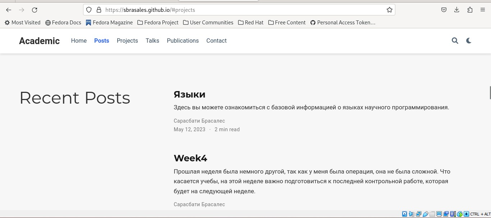

---
## Front matter
lang: ru-RU
title: Пятый этап индивидуального проекта
author:
  - Сарасбати Брасалес
institute:
  - Российский университет дружбы народов, Москва, Россия
date: 12/05/2023

## i18n babel
babel-lang: russian
babel-otherlangs: english

## Formatting pdf
toc: false
toc-title: Содержание
slide_level: 2
aspectratio: 169
section-titles: true
theme: metropolis
header-includes:
 - \metroset{progressbar=frametitle,sectionpage=progressbar,numbering=fraction}
 - '\makeatletter'
 - '\beamer@ignorenonframefalse'
 - '\makeatother'
---

# Информация

## Докладчик

:::::::::::::: {.columns align=center}
::: {.column width="70%"}

  * Сарасбати Брасалес
  * д.ф.-м.н., профессор
  * Российский университет дружбы народов
  * [sarasabati2904@gmail.com](sarasabati2904@gmail.com)

:::
::: {.column width="30%"}


:::
::::::::::::::

# Вводная часть

## Цель работы

Добавить с сайту все остальные элементы.


## Задание

Сделать записи для персональных проектов.

Сделать пост по прошедшей неделе.

Добавить пост на тему "Языки научного программирования".

# Выполнение работы

## Добавление записей проектов



## Добавление записей проектов



## Создание папок для постов



## Недельный пост



## Пост на тему по выбору



## Обновление сайта



# Вывод

## Вывод

Мы научились добавлять на сайт записи персональнх проектов и добавили на сайт два поста: недельный и по выбору


## Код для формата `pdf`

```yaml
slide_level: 2
aspectratio: 169
section-titles: true
theme: metropolis
```


:::

