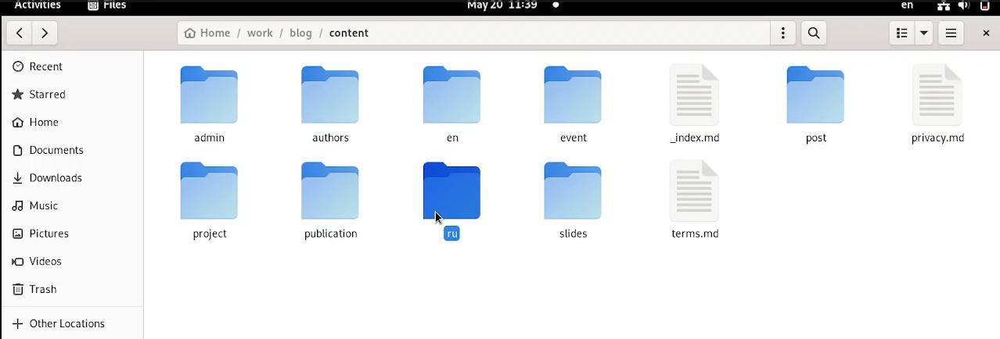
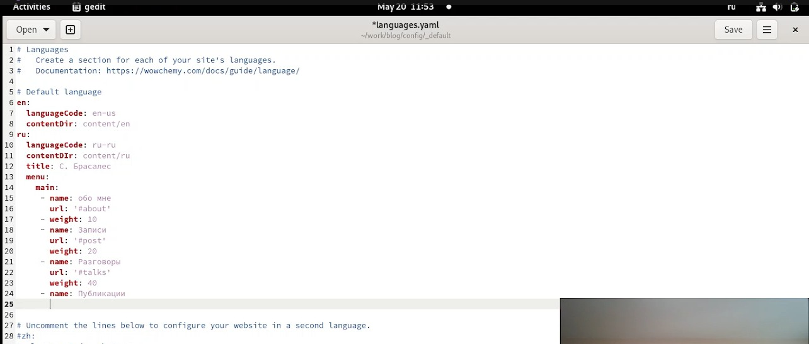
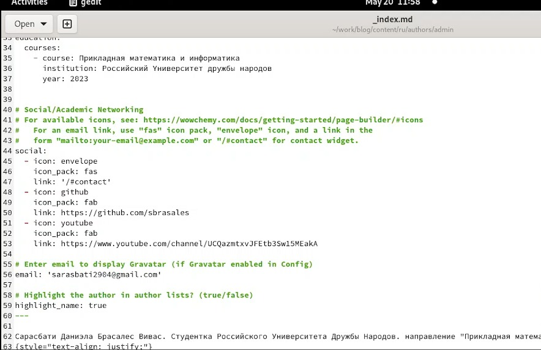
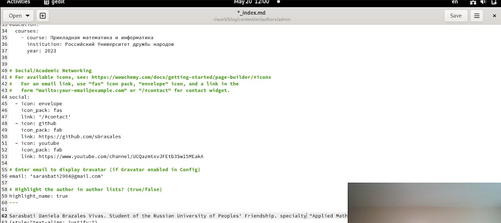
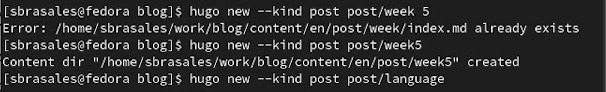
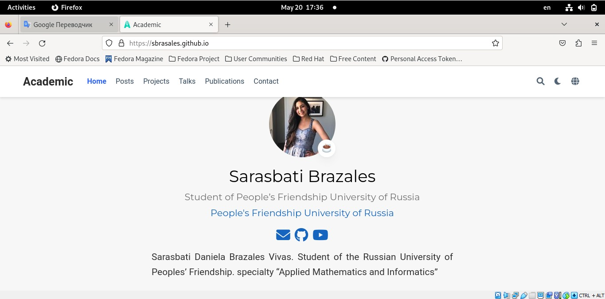

---
## Front matter
lang: ru-RU
title: Шестой этап индивидуального проекта
author:
  - Брасалес Сарасбати
institute:
  - Российский университет дружбы народов, Москва, Россия
date: 20/05/2023

## i18n babel
babel-lang: russian
babel-otherlangs: english

## Formatting pdf
toc: false
toc-title: Содержание
slide_level: 2
aspectratio: 169
section-titles: true
theme: metropolis
header-includes:
 - \metroset{progressbar=frametitle,sectionpage=progressbar,numbering=fraction}
 - '\makeatletter'
 - '\beamer@ignorenonframefalse'
 - '\makeatother'
---

# Информация

## Докладчик

:::::::::::::: {.columns align=center}
::: {.column width="70%"}

  * Сарасбати Брасалес
  * Российский университет дружбы народов
  * [sarasbati2904@gmail.com](sarasbati2904@gmail.com.)


:::
::: {.column width="30%"}


:::
::::::::::::::

# Вводная часть

## Цель

Разместить двуязычный сайт на Github

## Задание

Сделать поддержку английского и русского языков.
Разместить элементы сайта на обоих языках.
Разместить контент на обоих языках.
Сделать пост по прошедшей неделе.
Добавить пост на тему по выбору (на двух языках).

# Выполнение лабораторной работы



# Создание папок двух языков


# Поддержка русского языка на сайте



# Перевод всех данных



# Перевод всех данных



# Создание папок постов



# Готовый сайт 



# Вывод

## Вывод

Мы разместили двуязычный сайт на Github

## Код для формата `pdf`

```yaml
slide_level: 2
aspectratio: 169
section-titles: true
theme: metropolis
```


:::

